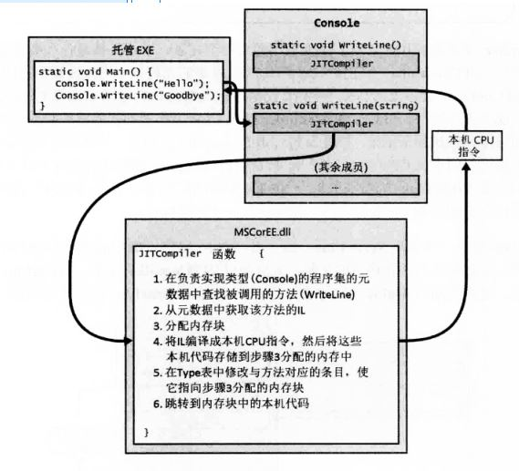
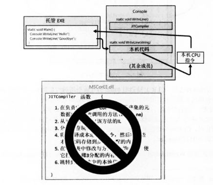
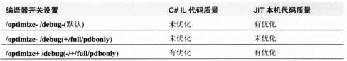
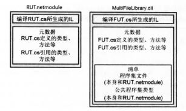
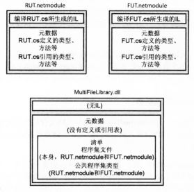
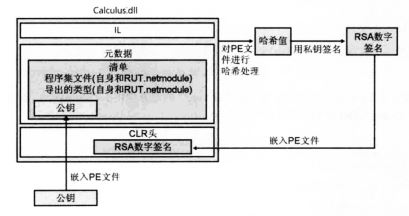
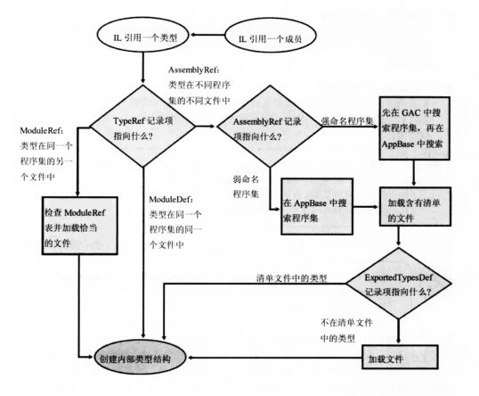

- 将源代码编译成托管模块
- 将托管代码合并成程序集
- 加载公共语言运行时
- 执行程序集的代码
- 本机代码生成器：NGen.exe
- Framework类库
- 通用类型系统
- 公共语言规范(CLS)
- 与非托管代码的互操作性

## 1.1 将源代码编译成托管代码
- 公共语言运行时(Common Language Runtime)，可由多种语言使用的“运行时”。
- CLR 的核心功能(内存管理、程序集加载、安全性、异常处理和线程同步)可由面向 CLR 的所有语言使用。
- 可将编译器视为语法检查器和“正确代码”分析器。
- 编译器的结果都是 托管模块(managed modele)。托管模块是标准的32位 Microsoft Windows 可移植执行体(PE32 Portable Executable)文件，或是标准的64位 Windows 可移植执行体(PE32+)文件，都需要CLR才能运行。
- 托管程序集总是利用 Windows 的数据执行保护(Data Execution Prevention, DEP)和地址空间布局随机化(Address Space Layout Randomization, ASLR)，这两个功能旨在增强整个系统的安全性。
- 托管模块的组成部分：
	- PE32 或 PE32+头
	- CLR头
	- 元数据
	- IL代码
- 元数据的用途(部分)：
	- 元数据避免了编译时对原生 C/C++ 头和库文件的需求，因为在实现类型/成员的 IL 代码文件中，已包含有关引用类型/成员的全部信息。编译器直接从托管模块读取元数据。
	- Microsoft Visual Studio 用元数据帮助写代码。“智能感知”(IntelliSense)技术会解析元数据，告诉你一个类型提供的方法属性事件字段，对于方法还提供参数。
	- CLR 的代码验证过程使用元数据确保代码只执行“类型安全”的操作。
	- 元数据允许将对象的字段序列化到内存块，将其发送给另一台机器，然后反序列化，在远程机器上重建对象状态。
	- 元数据允许垃圾回收器跟踪对象生存期。垃圾回收器能判断任何对象的类型，并从元数据知道那个对象中的哪些字段引用了其它对象。
- C#编辑器总生成包含托管代码和托管数据的模块。
- Microsoft C++编译器允许在托管代码中使用原生 C/C++ 代码。时机成熟后再使用托管类型。

## 1.2 将托管模块合并成程序集
- CLR 实际不和模块工作。它和程序集工作。程序集(assembly)是抽象概念，是一个或多个模块/资源文件的逻辑性分组。程序集是重用、安全性以及版本控制的最小单元。取决于选择的编译器，既可生成单文件程序集，也可生成多文件程序集。在 CLR 中相当于“组件”。
- 利用“程序集”这种概念性的东西，一组文件可作为一个单独的实体来对待。
- 程序集模块是代表逻辑分组的一个PE32(+)文件，包含一个名为清单(manifest)的数据块。清单也是元数据表的集合。这些表描述了构成程序的文件、程序集中的文件所实现的公开导出的类型以及与程序集关联的资源或数据文件。
- 程序集的模块中，还包含与应用的程序集有关的信息(包括它们的版本号)。这些信息使程序及能够自描述(self-describing)。也就是，CLR 能判断为了执行程序集中的代码，程序集的直接依赖对象(immediate dependency)是什么。不需要在注册表或 Active Directory Domain Services(ADDS)中保存额外的信息，所以和非托管组件相比，程序及更容易部署。

## 1.3 加载公共语言运行时
- 要知道是否已安装.NET Framework，检查 %SystemRoot%\System32 目录中是否存在 MSCoreEE.dll。
- 要了解安装了哪些版本的.NET Framework，检查以下目录的子目录：
	- %SystemRoot%\Microsoft.Net\Framework
	- %SystemRoot%\Microsoft.Net\Framework64
- .NET Framework SDK 提供了 CLRVer.exe 命令行，能列出机器上安装的所有CLR版本。(null 或 -all 或 指定目标进程)
- 如果程序及文件只包含类型安全的托管代码，只要机器上安装了对应版本的.NET Framework，文件就能运行。
- 要适用不安全的代码，或者要和面向一种特定 CPU 架构的非托管代码进行互操作，就可能需要C#编译器中 /platform 命令行开关选项。可指定 32位 Windows x86,64位 Windows x64，32位 Windows RT ARM 机器。不指定则为 anycpu。
- Exe运行：
	- Windows检查EXE文件头，决定32位/64位进程后，会在进程地址空间加载 MSCorEE.dll 的 x86,x64或ARM版本。
	- Windows x86或ARM, MSCorEE.dll的x86版本在 %SystemRoot%\System32。
	- Windows x64, MSCorEE.dll的x86版本在 %SystemRoot%\SysWow64, x64版本在 %SystemRoot\System32% (为了向后兼容)。
	- 进程的主线程调用 MSCorEE.dll 中定义的一个方法。这个方法初始化 CLR，加载 EXE 程序集，再调用其入口方法(Main)。随即，托管应用程序启动并运行。

## 1.4 执行程序集的代码
- 托管程序集包含元数据和IL。可将IL视为一种面向对象的机器语言。
- IL也能使用汇编语言编写，Microsoft提供了 ILAsm.exe(IL汇编器)，ILDasm.exe(IL反汇编器)。
- 高级语言通常只公开了CLR全部功能的一个子集。IL汇编语言允许访问CLR的全部功能。
- 允许在不同编程语言之间方便地切换，同时又保持紧密集成，是CLR一个出众的特点。
- 为了执行方法，首先必须把方法的 IL 转换成本机(native)CPU 指令，这是 CLR 的JIT(just-in-time或者"即时")编译器的职责。

- 一个方法首次调用时发生的事情。


- 在 Main 方法执行之前，CLR 会检测出 Main 的代码引用的所有类型。CLR 分配一个内部数据结构来管理对引用类型的访问。如上，Main 引用了一个 Console 类型，CLR分配一个内部结构。在内部结构中，Console 类型定义的每个方法都有一个对应的记录项(entry,条目,入口)。每个记录项都含有一个地址，根据地址可找到方法的实现。对这个结构初始化时，CLR将每个记录项都设置成(指向)包含在CLR内部的一个为编档函数，称为 JITCompiler。
- Main 方法首次调用 WriteLine 时，JITCompiler 函数会被调用。JITCompiler 函数负责将方法的 IL 代码编译成本机 CPU 指令。IL是即时(just in time)编译的。CLR这个组件称为 JITter 或 JIT编译器。
- JITCompiler 函数被调用时，它知道调用的是哪个方法，以及什么类型定义了该方法。然后，JITCompiler 会在定义(该类型的)程序集的元数据中查找被调用方法的 IL。接着，JITCompiler 验证 IL 代码，并将 IL 代码编译成本机CPU指令。本机CPU指令保存到动态分配的内存块中。然后，JITCompiler 回到 CLR 为类型创建的内部数据结构，找到与被调用方法对应的那条记录，修改最初对 JITCompiler 的引用，使其指向内存块(包含了刚才编译好的本机CPU指令)的地址。最后，JITCompiler 函数跳转到内存块中的代码。这些代码即是方法的具体实现。代码执行完毕返回。
- Main 第二次调用 WriteLine。由于已对 WriteLine 的代码进行了验证和编译，所以会直接执行内存块中的代码，完全跳过 JITCompiler 函数。


- 方法仅在首次调用时才会有一些性能损失。以后对于该方法的所有调用都以本机代码的形式全速运行，无需重新验证 IL 并把它编译成本机代码。
- JIT 编译器将本机CPU指令存储到动态内存中。所以重启应用或开多个实例(使用多个不同的操作系统进程)，JIT 必须再次将 IL 编译成本机指令。相比之下，本机(native)应用程序的只读代码页可由应用程序正在运行的所有实例共享。
- CLR 的 JIT编译器会对 本机代码进行优化，这类似于非托管C++编译器的后端所做的事情。同样，可能花较多时间生成优化代码。

- 两个C#编译器开关会影像代码优化： `/optimize` 和 `/debug`。
- 使用 `/optimize-` ，在C#编译器生成的未优化 IL 代码中，将包含许多 NOP(no-operation，空操作)指令，还包含许多跳转到下一行代码的分支指令。Visual Studio 利用这些指令在调试期间提供“编辑并继续”(edit-and-continue)功能。另外，利用这些额外的指令，还可在控制流程指令(比如 for, while, do, if, else, try, catch 和 finally 语句块)上设置断点，使代码更容易调试。相反，如果生成优化的 IL 代码，C#编译器会删除多余的 NOP 和分支指令。而在控制流程被优化之后，代码就很难在调试器中进行单步调试了。另外，若在调试器中执行，一些函数求值可能无法进行。不过，优化的 IL 代码变得更小，结果 EXE/DLL 文件也更小。另外，如果要检查 IL 来理解编译器生成的东西，这种 IL 更易读。
- 此外，只有指定 `/debug(+/full/pdbonly)`开关，编译器才会生成 Program Database(PDB)文件。PDB文件帮助调试器查找局部变量并将 IL 指令映射到源代码。`/debug:full` 开关告诉 JIT 编译器你打算调试程序集，JIT 编译器会记录每条 IL 指令所生成的本机代码。这样就可以利用Visual Studio的“即时”调试功能，将调试器连接到正在运行的进程，并方便地对源代码进行调试。不指定 `/debug:full` 开关，JIT 编译器默认不记录 IL 与本机代码的联系，这使 JIT 编译器运行得稍快，用的内存也稍少。如果进程用Visual Studio调试器启动，会强迫 JIT 编译器记录 IL 与本机代码的联系(无论 /debug 开关的设置是什么)————除非在Visual Studio中关闭了“在模块加载时取消 JIT 优化(仅限托管)”选项。
- 在 Visual Studio 中新建C#项目时，项目的“调试”(Debug)配置指定的是 `/optimize-` 和 `/debug:full` 开关，而“发布”(Release)配置指定的是 `/optimize+` 和 `/debug:pdbonly` 开关。
- 非托管代码针对一种具体的CPU平台编译，调用直接就能执行。
- 托管环境，代码分两阶段编译：首先，编译器遍历源代码，做大量工作生成 IL 代码。想要执行，这些 IL 代码本身必须在运行时编译成本机CPU指令，这需要分配更多的非共享内存，并要花费额外的CPU时间。
- 运行时的二次编译确实会影响性能，也确实会分配动态内存。但 Microsoft 进行了大量性能优化工作，将额外的开销保持在最低限度之内。
- 托管应用程序的性能实际上超越了非托管应用程序。当 JIT 编译器在运行时将 IL 代码编译成本机代码时，编译器对执行环境的认识比非托管编译器更深刻：
	- JIT 编译器能判断应用程序是否运行在 Intel Core i7 CPU 上，并生成相应的本机代码来利用 Core i7 支持的任何特殊指令。相反，非托管应用程序通常是针对具有最小功能集合的 CPU 编译的，不会使用能提升性能的特殊指令。
	- JIT 编译器能判断一个特定的测试在它运行的机器上是否总是失败。例如，`if (numberOfCPUs > 1) { ... }`。如果主机只有一个CPU，JIT编译器不会为上述代码生成任何CPU指令。在这种情况下，本机代码将针对主机进行优化，最终代码变得更小，执行更快。
	- 展望：应用程序运行时，CLR 可以进行评估代码的执行，并将 IL 重新编译成本机代码。重新编译的代码可以重新组织，根据刚才观察到的执行模式，减少不正确的分支预测。
- 为了确认 JIT 编译器使应用程序达到应有的性能。
- 应使用 .NET Framework SDK 配套提供的 NGen.exe 工具。它将程序集的所有 IL 代码编译成本机代码，并将其保存到一个磁盘文件中。在运行时加载程序集时，CLR 自动判断是否存在该程序集的预编译版本。如果是，CLR就加载预编译代码，就避免了在运行时进行编译。注意，NGen.exe 对最终执行环境的预设是很保守的(不得不)。所以，NGen.exe 生成的代码不会像 JIT 编译器生成的代码那样进行高度优化。
- 另外可考虑使用 System.Runtime.ProfileOptimization 类。该类法制 CLR 检查程序运行时哪些方法被 JIT 编译，结果被记录到一个文件。程序再次启动时，如果是在多CPU机器上运行，就用其他线程并发编译这些方法。这使应用程序运行得更快，因为多个方法并发编译，而且是在应用程序初始化时编译，而不是在用户和程序交互时才“即时”编译。

### 1.4.1 IL 和验证
- IL 基于栈。它的所有指令都要将操作数压入(push)一个执行栈，并从栈弹出(pop)结果。由于 IL 没有提供操作寄存器的指令，所以人们可以很容易地创建新的语言和编译器，生成面向 CLR 的代码。
- IL 指令是"无类型"(typeless)的。例如，IL 用 `add` 指令将压入栈的最后两个操作数加到一起。`add`指令不分 32/64位 。`add`执行时，它判断栈中的操作数的类型，给予恰当操作。
- IL 最大的优势不是对底层CPU的抽象，而是应用程序的健壮性和安全性。将 IL 编译成本机CPU指令时，CLR执行一个名为验证(verification)的过程。会检查高级 IL 代码，确定代码所做的一切都是安全的。
- Windows 的每个进程都有自己的虚拟地址空间，因为应用程序完全可能读写无效的内存地址。通过验证托管代码，可确保代码不会不正确的访问内存，就可以将多个托管应用程序放到同一个Windows虚拟地址空间运行。
- 用一个进程运行多个应用程序，减少进程数，增强性能，减少所需资源，健壮性也无下降，这是托管代码相较于非托管代码的另一优势。CLR 提供了在一个操作系统进程中执行多个托管应用程序的能力。每个托管应用程序都在一个 AppDomain 中执行。每个托管 EXE 文件默认都在自己的独立地址空间中运行，这个地址空间只有一个 AppDomain。然而，CLR 的宿主进程(比如 IIS 或 Microsoft SQL Server)可决定在一个进程中运行多个 AppDomain。
- 使用不安全的(unsafe)代码可能破坏数据结构，危害安全性，造成安全漏洞。C#编译器要求包含不安全代码的所有方法都用`unsafe`关键字标记。并使用`/unsafe`编译器开关来编译源代码。
- 当 JIT 编译器编译 `unsafe` 方法时，会检查方法程序集是否被授予 `System.Security.Permissions.SecurityPermission` 权限，而且 `System.Security.Permissions.SecurityPermissionFlag` 的 `SkipVerification` 标志是否设置。如果设置，会编译并允许执行。没设置，JIT 编译器会抛出 `System.InvalidProgramException` 或 `System.Security.VerificationException` 异常，禁止方法执行。
- 从本地计算机或“网络共享”加载的程序集默认被授予完全信任，但通过 Internet 执行的程序集默认不被授予执行不安全代码的权限。
- Microsoft 提供了 PEVerify.exe，他检查一个程序集的所有方法，并报告其中含有不安全代码的方法。(测试:通过内网或Internet)。
- 验证要访问所有以来的程序集中包含的元数据。当使用 PEVerity 检查程序集时，它必须能够定位并加载引用的所有程序集。PEVerity 使用 CLR 定位依赖程序集，采用平时执行程序集时一样的 绑定(binding) 和 探测(probing) 来定位程序集。

## 1.5 本机代码生成器 NGen.exe
- 在应用程序安装到用户的计算机上时，将 IL 代码编译成本机代码。因此，CLR 的 JIT 编译器不需要再运行时编译 IL 代码，有助于提升应用程序的性能。
- 1.提高应用程序的启动速度
- 2.减小应用程序的工作集(working set)(指在进程的所有内存中，已映射的物理内存)。如果一个程序集同时加载到多个进程中，对该程序集运行 NGen.exe 可减小应用程序的工作集。NGen.exe 将 IL 编译成本机代码，并将这些代码保存到单独的文件中。文件通过“内存映射”同时映射到多个进程地址空间中，使代码得到共享，避免每个进程都需要一份单独的代码拷贝。
- 进程：物理内存(CPU可直接访问)，虚拟内存(可能在转换列表中，CPU不能通过虚地址访问，需要Windows映射之后才能访问)，磁盘上的分页文件。
- 安装程序调用 NGen.exe 是，应用程序的所有或指定程序集的 IL 代码会编译成本机代码。NGen.exe 新建一个程序集文件，只包含这种本机代码，不含任何 IL。放在 `%SystemRoot%\Assembly\NativeImages_v4.0.#####_64` 这样的一个目录下的一个文件夹中。目录名包含 CLR版本号，本机代码是由 32\64 Windows编译。
- 当 CLR 加载程序集文件，都会检查是否有 NGen 生成的本机文件，如果找不到就对 IL 进行 JIT 编译。
- NGen好处：
	- 托管代码的好处(垃圾回收、验证、类型安全等)。
	- 没有托管代码(JIT编译)的所有性能问题等。
- NGen生成的文件的问题：
	- 没有知识产权保护。只发布 NGen.exe 来达到保护是不行的。在运行时，CLR 要求访问程序集的元数据(用于反射和序列化等)，所以必须要发布包含 IL 和元数据的程序集。CLR 也可能因为某些原因不能使用 NGen 生成的文件。
	- NGen 生成的文件可能失去同步。CLR 加载 NGen 生成的文件时，会将预编译代码和许多特征与当前执行环境进行比较。例句部分特征：
		- CLR 版本：随补丁或 Service Pack 改变。
		- CPU 类型：升级处理器发生改变、
		- Windows 操作系统版本：安装新 Service Pack 后改变。
		- 程序集的标识模块版本ID(Modele Version ID, MVID)：重新编译后改变。
		- 引用的程序集的版本ID：重新编译引用的程序集后改变。
		- 安全性：吊销了之前的授权后，安全性就会发生改变。权限包括声明性继承(declarative inheritance)、声明性连接时(declarative link-time)、SkipVerification 或者 UnmanagedCode 权限。
		- `注意 可使用更新(update)模式运行 NGen.exe，使 NGen 生成的文件与新安装的 CLR 版本同步，在安装.NET Framework 的新 Service Pack 时，安装程序会自动用更新模式运行 NGen.exe`
	- 较差的执行时性能。编译时，NGen 不能像 JIT 编译器那样对执行环境进行许多假定。例如，NGen 不能优化地使用特定 CPU 指令；静态字段只能间接访问(实际地址只能在运行时确定)。假如考虑使用 NGen.exe 来提升应用程序的性能，需进行比较。
	
- 对于服务器端应用程序，NGen.exe 的作用不明显甚至无作用，因为只有第一个客户端请求才能感受到性能的下降，后续的客户端请求都能以全速运行。
- 对于客户端应用程序，使用 NGen.exe 也许能提高启动速度，或者缩小工作集。
- 对于启动很慢的大型客户端应用程序，Microsoft 提供了 Managed Profile Guided Optimization 工具(MPGO.exe)。该工具分析程序执行，检查它在启动时需要那些东西。这些东西反馈给 NGen.exe 来更好的优化本机映像，使应用程序启动更快工作集缩小。准备发布应用程序时，用 MPGO 工具启动它，走一遍程序的常规任务。与所执行代码有关的信息会写入一个 profile 并嵌入程序集文件中。NGen.exe 工具利用 profile 数据来更好地优化它生成的本机映像。

## 1.6 Framework 类库
- .NET Framework 包含 Framework 类库(Framework Class Library, FCL)。FCL 是一组 DLL 程序集的统称，其中含有数千个类型定义，每个类型都公开了一些功能。Microsoft 还发布了其他库，比如 Windows Azure SDK 和 DirectX SDK。
- 利用这些程序集创建的部分应用：
	- Web 服务(Web service)
	利用 Microsoft 的 ASP.NET XML Web Service 技术或者 Microsoft 的 Windows Communication Foundation(WCF)技术，可以简单地处理通过 Internet 发送的消息。
	- 基于 HTML 的 Web 窗体/MVC 应用程序(网站)
	ASP.NET 应用程序查询数据库并调用 Web 服务，合并和筛选返回的信息，使用基于 HTML 的“富”用户界面，在浏览器中显示。
	- “富” Windows GUI 应用程序
	用 Windows Store、Windows Presentation Foundation(WPF) 或者 Windows Forms 技术提供更强大性能更好的功能。可以直接与底层操作系统交换信息。
	- Windows 控制台应用程序
	对UI要求很简单。编译器、实用程序和工具。
	- Windows 服务
	用 .NET Framework 生成“服务”应用程序，通过“Windows 服务控制管理器”(Service Control Manager, SCM)控制。
	- 数据库存储过程
	Microsoft 的 SQL Server、IBM 的 DB2 以及 Oracle 的数据库服务器允许用 .NET Framework 写存储过程。
	- 组件库
	.NET Framework 允许生成独立程序集(组件)。

## 1.7 通用类型系统
- Microsoft 指定了一个正式的规范类描述类型的定义和行为，“通用类型系统”(Common Type System, CTS)。
- Microsoft 将 CTS 和 .NET Framework 的其他组件(包括文件格式、元数据、中间语言以及对底层平台的访问(P/Invoke))提交给 ECMA 标准化，形成的标准为“公共语言基础结构”(Common Language Infrastructure, CLI)。Microsoft 还提交了 Framework 类库的一部分，C#编程语言(ECMA-334)以及 C++/CLI 编程语言。
- CTS 规范规定，一个类型可以包含零个或者多个成员。
	- 字段(Field)
	- 方法(Mehtod)
	- 属性(Property)
	- 事件(Event)
- CTS 制定了类型可见性规则以及类型成员的访问规则。
	- private
	- family(protected in C#)：派生类
	- family and assembly(C#中没有提供)
	- assembly(internal in C#)：同一程序集
	- family or assembly(protected internal in C#)：任何程序集中的派生类或同一程序集中的任意类。
	- public
- CTS 为类型继承、虚方法、对象生存期等定义了相应的规则。
- CTS 规定单继承
- CTS 规定所有类型最终必须从预定义的 `System.Object` 继承。`System.Object` 允许做：
	- 比较两个实例的相等性。
	- 获取实例的哈希码。
	- 查询一个实例的真正类型。
	- 执行实例的浅(按位)拷贝。
	- 获取实例对象当前状态的字符串表示。

## 1.8 公共语言规范
- 创建从其他编程语言中访问的类型，Microsoft 定义了“公共语言规范”(Common Language Specification, CLS)，详细定义了一个最小功能集。

- 每种语言都提供了 CLR/CTS 的一个子集以及 CLS 的一个超集(但不一定是同一超集)
- 以下代码使用 C# 定义一个符合 CLS 的类型。类型中含有几个不符合 CLS 的构造，造成 C# 编译器报错：

```
using System;

// 告诉编译器检查 CLS 相容性
[assembly: CLSCompliant(true)]

namespace SomeLibrary {
	// 因为是 public 类，所以会显示警告
	public sealed class SomeLibraryType {

		// 警告：SomeLibrary.SomeLibraryType.Abc() 的返回类型不符合 CLS
		public UInt32 Abc() { return 0; }

		// 警告：仅大小写不同的标识符 SomeLibrary.SomeLibraryType.abc() 不符合CLS
		public void abc() { }

		// 不显示警告：该方法是私有的
		private UInt32 ABC() { return 0; }
```

- 将 `[assembly:CLSCompliant(true)]` 特性应用于程序集。编译器检查其中的任何公开类型，判断是否存在任何不合适的构造阻止了从其他编程语言中访问该类型。

## 1.9 与非托管代码的互操作性
- CLR 允许在应用程序中同时包含托管和非托管代码。
	- 托管代码能调用 DLL 中的非托管函数
	托管代码通过 P/Invoke(Platform Invoke)机制调用 DLL 中的函数。
	- 托管代码可以使用现有 COM 组件(服务器)
	- 非托管代码可以使用托管类型(服务器)
- Microsoft 公开了 Type Library Importer 工具和 P/Invoke Interop Assistant 工具的源码，Http://CLRInterop.CodePlex.com


# 2 生成、打包、部署和管理应用程序及类型
- .NET Framework 部署目标
- 将类型生成到模块中
- 元数据概述
- 将模块合并成程序集
- 程序及版本资源信息
- 语言文化
- 简单应用程序部署(私有部署的程序集)
- 简单管理控制(配置)

## 2.1 .NET Framework 部署目标
- Windows 不稳定和过于复杂：
	- 所有应用程序都使用来自 Microsoft 或其他厂商的动态链接库(Dynamic-Link Library, DLL)。(DLL hell)
	- 安装的复杂性。(备份不易、移动不易、卸载不易)
	- 安全性。

## 2.2 将类型生成到模块中
- 源代码文件 Program.cs (C:\Program Files (x86)\MSBuild\14.0\Bin)

```
public sealed class Program {
	public static void Main() {
		System.Console.WriteLine("Hi");
	}
}
```

- cmd 执行 csc.exe /out:Program.exe /t[arget]:exe /r[eference]:MSCorLib.dll program.cs
- 可简化成 csc.exe Program.cs
- csc.exe /out:Program.exe /t:exe /nostdlib Program.cs 报错，没有自动引用 MSCorLib.dll
- C# 编译器生成的 Program.exe 文件是标准 PE(可移植执行体, Portable Executable)，意味着 Windows 32/64 能加载它。
- Windows 支持三种应用程序：
	- 生成 控制台用户界面(Console User Interface, CUI) 应用程序使用 `/t:exe` 开关。
	- 生活 图形用户界面(Graphical User Interface, GUI) 应用程序使用 `/t:winexe` 开关。
	- 生成 Windows Store 应用使用 `/t:appcontainerexe` 开关。
- 响应文件：包含一组编译器命令行开关的文本文件。MyProject.rsp:
	```
	/out:MyProject.exe
	/target:winexe
	```
- CSC.exe 使用响应文件：
`csc.exe @MyProject.rsp CodeFile1.cs CodeFile2.cs`
- C# 编译器支持多个响应文件。CSC.exe 运行时，会在其所在目录查找全局 CSC.rsp 文件。设置发生冲突：命令行显式指定 > 本地响应文件 > 全局响应文件。
- .NET Framework 目录 %SystemRoot%\Microsoft.NET\Framework(64)\vX.X.X 中有全局 CSC.rsp 文件。
- 引用所有这些程序集对编译器的速度有一点影像，但如果源代码中没有引用，就不会影像最终程序集。
- 指定 `/noconfig` 命令行开关，编译器会忽略本地和全局 CSC.rsp 文件。

## 2.3 元数据概述
- Program.exe(托管 PE 文件)由四部分组成：
	- PE32(+)头：Windows 要求的标准信息。
	- CLR 头：是一个小的信息快，是托管模块特有的。模块生成时所面向的 CLR 的 major(主)和 minor(次)版本号；一些标志(flag)；一个 MethodDef token，该 token 指定了模块(CUI、GUI、WinStoreApp)的入口方法；一个可选的强名称数字签名。最后，CLR 头还包含模块内部的一些元数据表的大小和偏移量。查看 CorHdr.h 定义的 IMAGE_COR20_HEADER 了解 CLR 头的具体格式。
	- 元数据：是由三个表构成的二进制数据块。
		- 定义表(definition table)：ModuleDef(对模块进行标识)，TypeDef(类型)，MethodDef(方法)，FieldDef(字段)，ParamDef(参数)，PropertyDef(属性)，EventDef(事件)。
		- 引用表(reference table)：AssemblyRef(引用的每个程序集)，ModuleRef(引用的类型的每个 PE 模块)，TypeRef(引用的每个类型)，MemberRef(引用的每个成员(字段和方法，属性方法和事件方法))。
		- 清单表(manifest table)：??

- 检查 PE 文件中的元数据：ILDasm.exe 即 IL Disassembler(IL 反汇编器)。`ILDasm Program.exe`

## 2.4 将模块合并成程序集
- 程序集：
	- 定义了可重用的类型。
	- 用一个版本号标记。
	- 可以关联安全信息。
- 使用多文件程序集：
	- 不同的类型用不同的文件
	- 可在程序集中添加资源或数据文件。
	- 程序及包含的各个类型可以用不同的编程语言来实现。
- 程序集是重用、版本控制和应用安全型设置的基本单元。
- CLR 加载含有清单的文件，就可确定程序集的其他文件中，具体是哪一些文件包含应用程序引用的类型和资源。程序集的用户只需要知道含有清单的文件名称，文件的具体划分方式就是完全透明的。
- 如果多个类型能共享相同的版本号和安全性设置，建议将所有这些类型放到同一文件中，而不是分散到多个文件中，更不要分散到多个程序集中。处于对性能的考虑，每次加载文件或程序集。需要加载的文件/程序集数量越少，性能越好，加载较少的程序集有助于减小工作集(working set)，缓解进城地址控件的碎片化，nGen.exe 处理较大的文件时可以进行更好的优化。
- 生成程序集要么选择现有的 PE 文件作为“清单”的宿主，要么创建单独的 PE 文件只在其中包含清单。
- 托管模块转换成程序集的清单元数据表：AssemblyDef(引用程序集单一记录项)，FileDef(每个 PE 文件和资源文件)，ManifestResourcesDef(每个资源)，ExportedTypeDef(所有 PE 模块中导出的每个 public 类型)。
- 有了清单，用户不用关心程序集的划分细节，也使程序集具有自描述性(self-describing)。
- C# 编译器生成程序集开关：
	- `/t[arget]:exe` GUI 执行体
	- `/t[arget]:winexe` GUI 执行体
	- `/t[arget]:appcontainerexe` Windows Store 执行体
	- `/t[arget]:library` 类库
	- `/t[arget]:winmdobj` WINMD 库，生成的.winmdobj 文件需传给 WinMDExp.exe 进行处理。
	- `/t[arget]:modile` 不包含清单元数据表的 DLL PE 文件。默认扩展名.netmodule。使用 `/addmodule` 开关，`csc /out:MultiFileLibrary.dll /t:library /addmodule:RUT.netmodule FUT.cs`。`/addmodule` 开关告诉编译器将文件添加到 FileDef 清单元数据表，并将 RUT.netmodule 的公开导出类型添加到 ExportedTypesDef 清单元数据表。 

- 不能直接通过 VS IDE 中创建多文件程序集，只能用命令行工具创建多文件程序集。

### 2.4.1 使用 Visual Studio IDE 引用程序集。
### 2.4.2 使用程序集链接器
```
csc /t:module RUT.cs
csc /t:module FUT.cs
al /out:MultiFileLibrary.dll /t:library FUT.netmodule RUT.netmodule
```

最终程序集由三个文件构成：MultiFileLibrary.dll, RUT.netmodule, FUT.netmodule。程序集链接器不能将多个文件合并成一个文件。
- 调用 AL.exe 时添加 `/main` 命令行开关，可指定模块的哪个方法是入口。
```
csc /t:module /r:MultiFileLibrary.dll program.cs
al /out:Program.exe /t:exe /main:Program.Main Program.netModule
```

### 2.4.3 为程序集添加资源文件
- AL.exe 开关:
	- `/embed[resource]` 将文件作为资源添加到程序集并嵌入最终的 PE 文件。清单的 ManifestResourceDef 表会更新。
	- `/link[resource]` 指出资源包含在程序集的哪个文件中，不会嵌入程序集 PE 文件中，保持独立且必须跟其他程序集文件一起打包和部署。清单的 ManifestResourceDef 和 FileDef 表会更新。
- CSC.exe 的 `/resource` 和 `/linkresource` 相似。
- 为程序集嵌入标准的 Win32 资源：
	- AL.exe 或 CSC.exe： `/win32res` 指定一个.res 文件的路径名。
	- AL.exe 或 CSC.exe： `/win32icon` 指定一个.ico 文件的路径名。
- C# 编译器默认生成包含 Win32 清单资源信息。可使用 `/nowin32manifest` 不生成。

## 2.5 程序集版本资源信息
- 获取 PE 文件中嵌入的标准 Win32 版本资源信息，在应用程序代码中调用 `System.Diagnostics.FileVersionInfo` 的静态方法 `GetVersionInfo`，并传递程序集的路径为参数。
- 生成程序集时，使用定制特性设置各种版本资源字段，这些特性在源码中应用于 assembly 级别：
```
using System.Reflection;
// FileDescription 版本信息
[assembly: AssemblyTitle(MultiFileLibrary.dll)]
// LegalCopyright 版本信息
[assembly: AssemblyCopyright("Copyright (c) Chen 2018")]
// AssemblyVersion 版本信息
[assembly: AssemblyVersion("3.0.0.0")]
```
- IL.exe 有开关设置这些信息，不必使用定制特性。C#编译器没有提供命令行开关，必须使用定制特性。
- Visual Studio 中直接在 项目-Properties-AssemblyInfo.cs。 
- 版本号：major(主版本号).minor(次版本号).build(内部版本号).revision(修订号)。
- 程序集由三个版本号：
	- AssemblyFileVersion：存储在 Win32 版本资源中。仅供参考，CLR 不检查不关心。在 Windows 资源管理器中能看到。对客户系统进行故障诊断时，可根据它识别程序集的版本。
	- AssemblyInformationVersion：存储在 Win32 版本资源中。仅供参考，CLR 不检查不关心。指出包含该程序集的产品的版本。比如产品版本2.0，包含一个新开发的程序集版本为1.0，新开发的程序可设置这个版本号来代表产品的版本号。
	- AssemblyVersion：存储在 AssemblyDef 清单元数据表中。CLR 在绑定到强命名程序集时会用到。很重要，唯一地标识了程序集，开始开发程序集时，应该设置好 major/minor/build/revision 部分。除非要开发程序集的下一个可部署版本，否则不应变动。如果程序集 A 引用了强命名的程序集 B，B 的版本会嵌入 A 的 AssemblyRef 表。当 CLR 加载 B 时，就准确知道  B 的版本。利用绑定重定向(binding redirect)技术，可以让 CLR 加载一个不同的版本。

## 2.6 语言文化
- 程序集还将语言文化(culture)作为其身份标识的一部分。
- 未指定具体语言文化的程序集称为语言文化中性(culture neutral)。
- 使用 AL.exe 的 `/c[ulture]:en-US` 开关指定语言文化。部署附属程序集时，保存在专门的子目录中 C:\MyApp\en-US。在运行时，使用 `System.Resources.ResourceManager` 类访问附属程序集的资源。
- 创建包含代码的附属程序集也可以，使用定制特性 `System.Reflection.AssemblyCultureAttribute` 代替 AL.exe 的 `/culture` 开关。
```
// 将程序集的语言文化设为瑞士德语
[assembly:AssemblyCulture("de-CH")]
```
一般不要生成引用了附属程序集的程序集。程序集的 AssemblyRef 记录项只应引用语言文化中性的程序集。要访问附属程序集中的类型或成员，应使用反射技术。

## 2.7 简单应用程序部署(私有部署的程序集)
- Visual Studio 将 Windows Store 应用打包成一个.appx 文件。不同用户对应一个安装好的.appx。
- 对于非 WinStore 应用，直接批处理复制。也可使用 .cab 或 MSI。
- 也可使用 Visual Studio 内建机制发布。
- 在应用程序基目录或者子目录部署的程序集称为私有部署的程序集(private deployed assembly)。
- 能实现简单的安装/移动/卸载，因为每个程序集都用元数据注明了自己引用的程序集，不需要注册表设置。引用(别的程序集的)程序集限定了每个类型的作用域。一个应用程序总是和它生成和测试时的类型绑定。即使另一个程序集恰好提供了同名类型，CLR 也不可能加载那个程序集。这一点有别于 COM。在 COM 中，类型是在注册表中登记的，造成机器上运行的任何应用程序都能使用那些类型。

## 2.8 简单管理控制(配置)
- 实现对应用程序的管理控制，在应用程序目录放入一个配置文件。CLR 会解析文件内容来更改程序及文件的定位和加载策略。
- 配置文件包含 XML 代码，既能和应用程序关联，也能和机器关联。
- Program.exe.config
	```
	<configuration>
	  <runtime>
	    <assemblyBinding xmlns="urn:schemas-microsoft-com:asm.vl">
	      <probing privatePath="AuxFiles" />
	    </assemblyBinding>
	  </runtime>
	</configuration>
	```
- CLR 定位程序及文件时，现在应用程序基目录查找。如果没有找到，查找 AuxFiles 子目录。可为 `probing` 元素的 `privatePath` 特性指定多个以分号分隔的路径。每个路径都相对于应用程序基目录。
- XML 配置文件名称和位置：
	- 对于 EXE，配置文件在基目录，EXE 全名加.config。
	- 对于 ASP.NET Web 窗体应用程序，文件必须在 Web 应用程序的虚拟根目录中，且命名为 Web.config。子目录也可包含自己的 Web.config，且配置设置得到继承。eg.Http://Chenxinyuan.com/Github 的 Web 应用程序即会使用虚拟根目录的 Web.config 设置，也会使用 Github 子目录的。
- .NET Framework 在安装时会创建 %SystemRoot%\Microsoft.Net\Framework\version\config\machine.config。Machine.config 是机器上运行的所有应用程序的默认设置。
- CLR 定位程序及时会扫描基目录加通过配置文件 privatePath 指定的子目录。

# 3 共享程序集合
- 两种程序集，两种部署
- 为程序集分配强命名
- 全局程序集缓存
- 在生成的程序集中引用强命名程序集
- 强命名程序集能防篡改
- “运行时”如何解析类型引用
- 高级管理控制(配置)

## 3.1 两种程序集，两种部署
- CLR 支持两种程序集：弱命名程序集(避免歧义，没有术语对应)(weakly named assembly)和强命名程序集(strongly named assembly)。
- 弱命名和强命名程序集结构完全相同。区别在于：强命名程序集使用发布者的公钥/私钥进行了签名。这一对密钥允许对程序集进行唯一性的标识、保护和版本控制，并允许部署到任何地方。由于程序集被唯一性的标识，所以当应用程序绑定到强命名程序集时，CLR 可以应用一些已知安全的策略。
- 程序集可采用两种方式部署：私有和全局。
	- 私有部署指部署到应用程序基目录或某个子目录。
	- 全局部署指部署到一些公认位置。、
	- 强命名可私有可全局，弱命名只能私有。

## 3.2 为程序集分配强命名
- 由多个应用程序访问的程序集必须放到公认的目录。检测到对程序集的引用时，CLR 必须能够自动检查该目录。
- 问题：两个公司声称同名程序集，都放在相同公认目录，最后一个安装的会造成使用之前安装程序集的应用程序无法正常工作(Windows "DLL hell"，共享 DLL 全都复制到 System32 目录)。
- 强命名程序集 4 个重要特性：文件名(不计扩展名)、版本号、语言文化和公钥。
- 公钥数字很大，使用从公钥派生的小哈希值，称为公钥标记(public key token)。
- 程序集标识字符串(程序集显示名称)：
	```
	"MyTypes, Version=1.0.1.0, Culture=neutral, PublicKeyToken=b77a5c561934e089"
	"MyTypes, Version=1.0.1.0, Culture="en-US", PublicKeyToken=b77a5c561934e089"
	"MyTypes, Version=2.0.3.0, Culture=neutral, PublicKeyToken=b77a5c561934e089"
	"MyTypes, Version=1.0.1.0, Culture=neutral, PublicKeyToken=b03f5f7f1ld50a3a"
	```
- 无法根据“程序集标识符字符串”判断文件扩展名。
- 辅助类
	```
	System.Reflection.AssemblyName
	Culture, FullName, KeyPair, Name, Version
	GetPublicKey(), GetPublicKeyToken(), SetPublicKey(), SetPublicKeyToken()
	```	
- 创建强命名程序集：用 .NET Framework SDK 和 Microsoft Visual Studio 随带的 StrongName 实用程序(SN.exe)获取密钥。生成公钥/私钥对：`SN -k MyCompany.snk`。文件中包含二进制形式的公钥和私钥。
- 公钥数字很大：创建 .snk 后可使用 SN.exe 查看实际公钥。需要执行两次 SN.exe。
	- 第一次用 `-p` 创建只含共要的文件(MyConmpany.PublicKey):
	- `SN -p MyCompany.snk MyCompany.PublicKey sha256`
	- 第二次用 `-tp` 传递只含公钥的文件：
	- `SN -tp MyCompany.PublicKey`
	- 输出：公钥(哈希算法:sha256) + 公钥标记
- .Net Framework 4.5 引入了 增强型强命名(Enhanced Strong Naming)，生成与之前版本兼容的程序集，需用 AssemblySignatureKeyAttribute 创建联署签名(counter-signature)。‘
- SN.exe 未提供显示私钥的途径。
- 公钥太大，难以使用，设计了 公钥标记(public key token)。
- 公钥标记是公钥的64位哈希值。SN.exe 的 -tp 开关在输出结果末尾显示了对应的公钥标记。
- 创建强命名程序集：`csc /keyfile:MyCompany.snk Program.cs`
- C# 编译器看到`/keyfile:<file>`会打开指定文件(*.snk)，用私钥对程序集进行签名，并将公钥嵌入清单。只能对含清单的程序及文件进行签名：程序集其他文件不能被显式签名。
- “对文件进行签名”含义：生成强命名程序集时，程序集的 FileDef 清单元数据表列出构成程序集的所有文件。每讲一个文件名添加到清单，都对文件内容进行韩系处理。哈希值和文件名一道存储到 FileDef 表中。要覆盖默认哈希算法，使用 Al.exe 的`/algid`开关，或在程序集的某个源码中，在 assembly 这一级上应用定制特性 `System.Reflection.AssemblyAlgorithmIDAttribute`。默认使用 SHA-1 算法。
- 生成包含清单的 PE 文件后，会对 PE 文件的完整内容(除去 Authenticode Signature、程序集强名称数据及 PE 头校验和)进行哈希处理，如图。哈希值用发布者的私钥进行签名，得到的 RSA 数字签名存储到 PE 文件的一个保留区域(进行哈希处理时，会忽略这个区域)。PE 文件的 CLR 头进行更新，反映数字签名在文件中的嵌入位置。

- 发布者公钥也嵌入 PE 文件的 AssemblyDef 清单元数据表。
- 由于公钥是一个很大的数字，为了节省存储空间。Microsoft 对公钥进行哈希处理，并获取哈希值的最后8个字节。AssemblyRef 表实际存储的是这种简化的公钥值(公钥标记)。但 CLR 在做出安全或信任决策时，永远都不会使用公钥标记。

## 3.3 全局程序集缓存
- 由多个应用程序访问的程序集必须放在公认的目录，这个公认位置就是 全局程序集缓存(Global Assembly Cache, GAC)。一般是：`%SystemRoot%\Microsoft.NET\Assembly`。
- GAC 目录是结构化的：其中包含许多子目录，子目录名称用算法生成。不要手动复制程序集到 GAC 目录，要用工具完成。工具知道 GAC 的内部结构，并知道如何生成正确的子目录名。
- 开发和测试时在 GAC 中安装强命名程序集最常用的工具是 GACUtil.exe。
- 使用 GACUtil.exe 的 `/i` 开关将程序集安装到 GAC，`/u` 开关从 GAC 卸载程序集。
- 不能将弱命名程序集放到 GAC。向 GACUtil.exe 传递弱命名程序集的文件名会报错：`将程序集添加到缓存失败：尝试安装没有强命名的程序集。` 
- 在生产环境部署，安装或卸载程序集时指定 `/i`或`/u` 和`/r`。`/r`将程序集与Windows的安装与卸载引擎集成。告诉系统哪些应用需要程序集，并将应用程序与程序集绑定。
- 如果强命名程序集被打包到.cab 文件中，或者被压缩。首先必须解压成临时文件，再使用 GACUtil.exe 安装到 GAC 中。
- .NET Framework 重分发包不随带提供 GACUtil.exe。如果应用程序含有需要部署到 GAC 的程序集，应使用 Windows Installer(MSI)。

## 3.4 在生成的程序集中引用强命名程序集
- CSC.exe 会尝试在以下目录中查找程序集
	- 1.工作目录。
	- 2.CSC.exe 所在的目录，目录中还包含 CLR 的各种 DLL 文件。
	- 3.使用 `/lib` 编译器开关指定的任何目录。
	- 4.使用 LIB 环境变量指定的任何目录。
- 如果程序集引用了 System.Drawing.dll，并在指定 CSC.exe 时使用 `/reference:System.Drawing.dll`。编译器会在 CSC.exe 自己所在的目录找到 System.Drawing.dll 文件(该目录还存储了与编译器对应版本的CLR的DLL)。编译时在此找寻程序集，运行时不会。
- 装.NET Framework 时，会安装 Microsoft 的程序及文件的两份拷贝。一份安装到编译器/CLR 目录，一份安装到 GAC 的子目录。编译器/CLR 目录中的文件方便生成程序集，而 GAC 中的拷贝则方便在运行时加载。

## 3.5 强命名程序集能放篡改
- 程序集安装到 GAC 时，系统对包含清单的那个文件的内容进行哈希处理，将哈希值与 PE 文件中嵌入的 RSA 数字签名进行比较(在用公钥解除了签名之后)。系统还会对程序集的其他文件的内容进行哈希处理，并将哈希值与清单文件的 FileDef 表中存储的哈希值进行比较。
- 每次应用程序执行并加载程序集时，都会对文件进行哈希处理，以牺牲性能为代价，保证程序集文件内容没有被篡改。
- 将强命名程序集安装到 GAC 时，系统会执行检查，确保包含清单的文件没有被篡改，检查仅在安装时执行一次。
- 为增强性能，如果强命名程序集被完全信任，并加载到完全信任的 AppDomain 中，CLR 将不会检查该程序集是否被篡改。
- 从非 GAC 的目录中加载强命名程序集时，CLR 会校验程序集的清单文件，造成该文件每次加载都造成额外的性能开销。

## 3.6 延迟签名
- 开发测试程序集时，访问私钥麻烦。.NET Framework 提供了延迟签名(delayed signing)，也称部分签名(partial signing)。不用私钥签名，无法防篡改。
- C# 编译器使用 `/delaysign`。
- 编译器或 AL.exe 检测到要进行延迟签名，生成程序集的 AssemblyDef 清单记录项，包含程序集的公钥。文件内容不会在这个时候进行哈希处理。
- 目前生成的程序集没有有效签名。安装到 GAC 会失败，因为未对文件内容进行哈希处理(文件表面上已经被篡改了)。需要使用 SN.exe 指定 `-Vr` 开关，程序集在运行时加载时，CLR 会跳过对哈希值的检查。在内部，SN 的 `-Vr` 开关会将程序集的身份添加到注册表子项中：`HKEY_LOCAL_MACHINE\SOFTWARE\Microsoft\StrongName\Verification`。
- 打包部署：使用 SN.exe `-R`，并指定包含了私钥的文件。`-R` 指示 SN.exe 对文件内容进行哈希处理，并用私钥对其进行签名。使用 SN.exe `-Vu`或`-Vx` 重启对这个程序集的验证。
- 使用延迟签名技术开发程序集的步骤：
	- 开发期，有只含公钥的文件，使用 `/keyfile`和`/delaysign`编译。
	`csc /keyfile:MyCompany.PublicKey /delaysign MyAssembly.cs`
	- 生成程序集后，是 CLR 暂时信任程序集内容，不对其进行哈希处理，也不进行哈希比较。只需执行一次。
	`SN.exe -Vr MyAssembly.dll`
	- 重启验证
	`SN -Vu MyAssembly.dll`
	- 准备打包部署，有私钥文件。
	`SN.exe -Ra MyAssembly.dll MyCompany.PrivateKey`
- "加密服务提供程序"(Cryptographic Service Provider, CSP)提供了对密钥的位置进行抽象的容器。
- 如果公钥/私钥在 CSP 容器中，编译时(CSC.exe)指定 `/keycontainer` 而不是 `/keyfile` ；链接时(AL.exe)指定 `/keyname` 而不是 `/keyfile`；使用强命名程序(SN.exe)对延迟签名的程序集进行重新签名时，指定 `-Rc` 而不是 `-R`。
- 打包前，如果想对程序集运行混淆器(obfuscator)程序(完全签名后就不能运行混淆器，否则哈希值不正确)，或者进行其他形式的“生成后”(post-build)操作，就利用延迟签名技术。

## 3.7 私有部署强命名程序集
- 应用程序安装时安装一个 XML 配置文件，用 codeBase 元素指出共享程序集路径，实际标记了一个 URL。这个 URL 可引用用户机器上的任何目录，也可引用 Web 地址。如果引用 Web 地址，CLR 会自动下载文件，存到用户的下载缓存(%UserProfile%\Local Setting\Application Data\Assembly 下的子目录)。

## 3.8 “运行时”如何解析类型引用
```
public sealed class Program {
	public static void Main() {
		System.Console.WeiteLine("Hi");
	}
}
```
- 运行应用程序，CLR 会加载并初始化自身，读取程序集的 CLR 头，查找标识了应用程序入口方法(Main)的 MethodDefToken，检索 MethodDef 元数据表找到方法的 IL 代码在文件中的偏移量，将 IL 代码 JIT 编译成本机代码(编译时会对代码进行验证以确保类型安全)，最后执行本机代码。
- 解析引用的类型时，CLR 可能在三个地方找到类型：
	- 相同文件：编译时便能发现对相同文件中的类型的访问，称为早期绑定(early binding)。类型直接从文件中加载，执行继续。
	- 不同文件，相同程序集：“运行时”确保被引用的文件在当前程序集元数据的 FileDef 表中，检查加载程序集清单文件的目录，加载被引用文件，检查哈希值以确保文件完整性。发现类型的程序，执行继续。
	- 不同文件，不同程序集：如果引用的类型在其他程序集的文件中，“运行时”会加载被引用程序集的清单文件。如果需要的类型不在文件中，就继续加载包含了类型的文件。发现类型的成员，执行继续。
- 解析类型引用时有任何错误(找不到文件、文件无法加载、哈希值不匹配等)都会抛出相应异常。
- 注：ModuleDef，ModuleRef 和 FileDef 元数据表在引用文件时使用了文件名和扩展名。但 AssemblyRef 元数据表只使用文件名，无扩展名。和程序集绑定时，系统通过探测目录来尝试定位文件，自动附加 .dll 和 exe 扩展名。
- 注：可以向 System.AppDomain 的 AssemblyResolve，ReflectionOnlyAssemblyResolve 和 TypeResolve 事件注册回调方法。在回调方法中执行解决绑定问题的代码，使应用程序不抛出异常而继续运行。



- CLR 通过 名称、版本、语言文化、公钥 识别程序集
- CLR 通过 名称、版本、语言文化、公钥、CPU架构 识别GAC
- CLR 提供将类型(类、结构、枚举、接口或委托)从一个程序集移动到另一个程序集的功能。需要使用 `System.Runtime.CompilerServices.TypeForwardedToAttribute` 和 `System.Runtime.CompilerServices.TyteForwardedFromAttribute`。

## 3.9 高级管理控制(配置)
- XML配置文件(XML 文件为 CLR 提供了丰富的信息)：
	- probing 元素
	- 第一个 dependentAssembly, assemblyIdentity 和 bindingRedirect 元素
	- codeBase 元素
	- 第二个 dependentAssembly, assemblyIdentity 和 bindingRedirect 元素
	- publisherPolicy 元素

- 系统允许使用和元数据所记录的不完全匹配的程序集版本。

- 发布者策略控制
	- 发布者穿件包含该发布者策略配置文件的程序集：
	```
	AL.exe	/out:Policy.1.0. SomeClassLibrary.dll
			/version:1.0.0.0
			/keyfile:MyCompany.snk
			/linkresource: SomeClassLibrary.config
	```

- `/out` 告诉 AL.exe 创建新 PE 文件。Policy 告诉 CLR 该程序包含发布者策略信息。
- `/version` 发布者策略程序集的版本，与程序集本身没有任何关系。
- `/keyfile` 使用发布者的“公钥/私钥对”对发布者策略程序集进行签名。
- `linkresource` 告诉 AL.exe 将XML配置文件作为程序集的一个单独的文件。

- 发布者策略程序集必须安装到 GAC。
- 管理员可指示CLR忽略发布者策略程序集。应用程序配置文件添加 `publisherPolicy` 元素：`<publisherPolicy apply="no"/>`
- `publisherPolicy` 元素可作为应用程序配置文件的 `<assemblyBinding>` 元素的子元素使用，使其应用于所有程序集，也可作为应用程序配置文件的 `<dependantAssembly>` 元素的子元素使用，使其应用于特定程序集。

- 创建发布者策略程序集，发布者相当于肯定了程序集不同版本的兼容性。


II.设计类型
- 类型基础
- 基元类型、引用类型和值类型
- 类型和成员基础
- 常量和字段
- 方法
- 参数
- 属性
- 事件
- 泛型
- 接口

# 类型基础
- 所有类型都从 System.Object 派生
- 类型转换
- 命名空间和程序集
- 运行时的相互关系

## 4.1 所有类型都从 System.Object 派生
- System.Object 类提供的公共实例方法。
	- Equals：如果两个对象具有相同的值，就返回 true。(5.3.2)
	- GetHashCode：返回对象的值的哈希码。如果某个类型的对象要在哈希表集合(比如 Dictionary)中作为键使用，类型应重写该方法。方法应该为不同对象提供良好分布(所谓良好分布，是指这对所有输入，GetHashCode生成的哈希值应该在所有整数中产生一个随机的分布。)。将这个方法设计到 Object 中并不恰当。大多数类型永远不会在哈希表中作为键使用；该方法本该在接口中定义。(5.4)
	- ToString：默认返回类型的完整名称(this.GetType().FullName)。但经常重写该方法来返回它们的值的字符串表示(Boolean，Int32)。注意，`ToString`理论上应察觉与调用线程关联的 `CultureInfo` 并采取相应行动。(14)
	- GetType:返回从 `Type` 派生的一个类型的实例，指出调用 GetType 的对象是什么类型。返回的 Type 对象可以和反射类配合，获取与对象的类型有关的元数据信息。GetType 是非虚方法，目的是防止类重写改方法，隐瞒其类型，进而破坏类型安全性。(23)
- 从 System.Object 派生的类型能访问的受保护方法。
	- MenberwiseClone：这个非虚方法创建类型的新实例，并将新对象的实例字段设与 this 对象的实例字段完全一致。返回对新实例的引用。 
	- Finalize：在垃圾回收器判断对象应该作为垃圾被回收之后，在对象的内存被实际回收之前，会调用这个虚方法。需要在回收内存前执行清理工作的类型应重写该方法。(21)

- `new` 操作符所做的事情：
	- 计算类型及其所有基类型(一直到 System.Object，虽然它没有定义自己的实例字段)中定义的所有实例字段需要的字节数。对象每个对象都需要一些额外的成员(称为 overhead 成员，"开销成员")，包括“类型对象指针”(type object pointer)和“同步块索引”(sync block index)。CLR 利用这些成员管理对象。额外成员的字节数要计入对象大小。
	- 从托管堆中分配类型要求的字节数，从而分配对象的内存，分配的所有字节都设为0。
	- 初始化对象的“类型对象指针”和“同步块索引”成员。
	- 调用类型的实例构造器，传递在 `new` 调用中指定的实参。大多数编译器都在构造器中自动生成代码来调用基类构造器。最终调用 System.Object 的构造器。

- `new` 执行了所有操作后，返回指向新建对象一个引用(或指针)。
- 没有 `new` 对应的 `delete`，没有办法显示释放为对象分配的内存。(21)

## 4.2 类型转换
- is，as

## 4.3 命名空间和程序集
- C#的 using 指令指示编译器尝试为类型名称附加不同的前缀，直到找到匹配项。
- 检查类型定义时，编译器必须知道要在什么程序集中检查。通过 `/reference` 编译器开关实现。

## 4.4 运行时的相互关系
- CLR 的一个 Windows 进程。该进程可能有多个线程。线程创建时会分配到 1MB 的栈。栈空间用于向方法传递实参，方法内部定义的局部变量也在栈上。栈从高位内存向地位内存地址构建。
- 最简单的方法包含“序幕”(prologue)代码，在方法开始工作前对其进行初始化。“尾声”(epilogue)代码，在方法完成后对其进行清理，以便返回至调用者。

```
void M1() { String name = "Joe"; M2(name); ... return; }
void M2(String s) { Int32 length = s.Length; ... return; }
```
线程栈：
|	······
|	······
|	······
|————————————
|name(String)	M1的局部变量	| String name = "Joe"
|————————————
|s(String)		M2的参数		| 造成 name 中的地址被压入栈，变量 s 标识栈位置
|————————————				| M2(name)
|[返回地址]					| 调用方法会将“返回地址”压入栈
|————————————
|length(Int32)	M2的局部变量
|————————————
|

- M1调用M2，将局部变量 name 作为实参传递。造成 name 局部变量中的地址被压入栈。M2方法内部使用参数变量 s 标识栈位置。
- M2抵达 return，造成 CPU 的指令指针内设置成栈中的返回地址，M2的栈帧展开(unwind)。M1继续执行M2调用之后的代码，M1的栈帧将准确反映M1需要的状态。
- 栈帧(stack frame)代表当前线程的调用栈的一个方法调用。执行线程的过程中，进行的每个方法调用都会在调用栈中创建并压入一个 StackFrame。

- 复杂情况见书本P93。

- CLR工作方式关键词：线程栈、实参、局部变量、实参和变量如何引用托管堆上的对象。对象含有一个指针指向对象的类型对象(类型对象中包含静态字段和方法表)。JIT 编译器如何决定静态方法、非虚实例方法及虚实例方法的调用方式。

- CLR 开始在一个进程中运行时，会立即为 MSCorLib.dll 中定义的 System.Type 类型创建一个特殊的类型对象。其他类型对象都是该类型的“实例”。因此，其他对象的类型对象指针成员会初始化成对 System.Type 类型对象的引用。
- System.Type 类型对象的类型对象指针指向其本身。System.Object 的 GetType 方法返回存储在指定对象的“类型对象指针”成员中的地址。也就是，GetType 方法返回指向对象的类型对象的指针


# 基元类型、引用类型和值类型
- 编程语言的基元类型
- 引用类型和值类型
- 值类型的装箱和拆箱
- 对象哈希码
- dynamic 基元类型

## 5.1 编程语言的基元类型
- 分配一个整数：
```
System.Int32 a = new System.Int32();
int a = 0;
```
- 两种生成的 IL 代码完全一致。编译器直接支持的数据类型称为基元类型(primitive type)。基元类型直接映射到 Framework 类库(FCL)中存在的类型。eg.C#的 int 直接映射到 System.Int32 类型。
- 只要是符合公共语言规范(CLS)的类型，其他语言都提供了类似的基元类型。
- C#基元类型：sbyte, byte, short, ushort, int, uint, long, ulong, char, float, double, bool, decimal, string, object, dunamic。
- char System.Char 16位Unicode字符(char不像在非托管C++中那样代表一个8位值)
- decimal System.Decimal 128位高精度浮点值，常用语不容许舍入误差的金融计算。128位中，1位是符号，96位是值本身(N)，8位是比例因子(k)。decimal 实际值是 ±N×10^k，其中 -28<=k<=0。其余位没有使用。
- dynamic System.Object 对于CLR，dynamic 和 object 完全一致。但C# 编译器允许使用简单的语法让 dynamic 变量参与动态调度。(5.5)

- C#编译器支持与类型转换、字面值(literal，直接量或文字常量)以及操作符有关的模式。
- 对数字转换，C#总进行截断。Int32 a = (Single)6.8; a = 6;
- 基本类型能写成字面值(literal)。字面值可被看成是类型本身的实例。
- `Console.WriteLine(123.ToString() + 456.ToString());  // "123456"`

- checked 和 unchecked 基元类型操作
- 对基元类型执行的许多算术运算都可能造成溢出：
```
Byte b = 100;
b = (Byte)(b + 200);  // b计算完是44(或0x2C)
```
- 极少数时候(计算哈希值或者校验和)，这种溢出可以接受，还是所希望的。
- C/C++不将溢出视为错误，允许值回滚(wrap，wrap-around，指一个值超过了它的类型所允许的最大值，从而“回滚”到一个非常小的、负的或者未定义的值。)。
- CLR 提供了一些特殊的 IL 指令，允许编译器选择它认为最恰当的行为。CLR 有 `add` 指令，作用是将两个值相加，但不执行溢出检查。还有 `add.ovf`，在溢出时抛出`System.OverflowException`异常。同样的有 `sub/sub.ovf, mul/mul.ovf, conv/conv.ovf`。
- 溢出检查默认关闭。使用 `/checked+` 编译器开关全局控制。
- 特定区域控制，`checked`和`unchecked`。
```
UInt32 invalid = unchecked((UInt32)(-1));	// OK

Byte b = 100;
b = checked((Byte)(b+200));	// 抛出 OverflowException 异常
b = (Byte)checked(b+200);	// b为44，不会抛出异常

checked {				// 开始 checked 块
	Byte b = 100;
	b = (Byte)(b+200);	// 简化为 b+=200;	// 该表达式会进行溢出检查 
}						// 结束 checked 块
```
- 在 checked 操作符或语句中调用方法，不会对该方法造成任何影像。

# 5.2 引用类型和值类型
- CLR 支持两种类型：引用类型和值类型。
- 使用引用类型需留意性能问题：
	- 1.内存必须从托管堆分配。
	- 2.堆上分配的每个对象都有一些额外成员，这些成员必须初始化。
	- 3.对象中的其他字节(为字段而设)总是设为零。
	- 4.从托管堆分配对象时，可能强制执行一次垃圾回收。

- 值类型的实例一般在线程栈上分配。在代表值类型实例的变量中不包含指向实例的指针。相反，变量中包含了实例本身的字段。值类型的实例不受垃圾回收器的控制。
- 所有引用类型称为类，System.Exception 类。所有值类型称为结构或枚举，System.Int32 结构、System.IO.FileAttributes 枚举。
- 所有结构都是抽象类型 `System.ValueType` 的直接派生类。`System.ValueType` 本身又直接从 `System.Object` 派生。所有值类型都必须从 `System.ValueType` 派生。所有枚举都从 `System.Enum` 抽象类型派生，`System.Enum` 又从 `System.ValueType` 派生。
- 所有值类型都隐式密封，无法作为基类。

```
// 值类型(因为'struct')
struct SomeVal { public Int32 x; }

// 通过编译，因为 C# 认为 v1 的字段已初始化为 0
SomeVal v1 = new SomeVal();
Int32 a = v1.x;

// 不能通过编译，因为 C# 不认为 v1 的字段已初始化为 0
SomeVal v1;
Int32 a = v1.x;
```

- 值类型有时能提供更好的性能。除非满足一下全部条件，否则不应将类型声明为值类型。
	- 类型具有基元类型的行为。如果类型没有提供会更改其字段的成员，就说该类型是不可变(immutable)类型。对于许多值类型，建议将全部字段标记为 readonly(7)。
	- 类型不需要从其他任何类型继承。
	- 类型也不派生出其他任何类型。
	- !!!以下条件最好满足：
	- 类型的实例较小(16字节或更小)。
	- 类型的实例较大，但不作为方法实参传递，也不从方法返回。

- 值类型的主要优势是不作为对象在托管堆上分配。
	- 值类型对象有两种表示形式：未装箱和已装箱。引用类型总是处于已装箱形式。
	- 值类型从 System.ValueType 派生。该类型提供了与 System.Object 相同的方法。但 System.ValueType 重写了 Equals 方法，能在两个对象的字段完全匹配的前提下返回 true。此外，System.ValueType 重写了 GetHashCode 方法。生产哈希码时，这个重写方法所用的算法会将对象的实例字段中的值考虑在内。由于这个默认实现存在性能问题，所以定义自己的值类型时应重写 Equals 和 GetHashCode 方法，并提供它们的显示实现。
	- 由于不能将值类型作为基类型来定义新的值类型或者新的引用类型，所以不应在值类型中引入任何新的虚方法。所有的方法都隐式密封(不可重写)。
	- 引用类型的变量包含堆中对象的地址。引用类型的变量创建时默认初始化为 null，表名当前不指向有效对象。值类型的变量总是包含其基础类型的一个值，而且值类型的所有成员都初始化为 0。CLR 确实允许为值类型添加“可空”(nullability)标识。(19)
	- 将值类型变量赋给另一个值类型变量，会执行逐字段的复制。将引用类型的变量赋给另一个引用类型的变量只复制内存地址。
	- 基于上一条，两个或多个引用类型变量能引用堆中同一个对象，所以对一个变量执行的操作可能影响到另一个变量引用的对象。对值类型变量执行的操作不可能影响另一个值类型变量。

- CLR 如何控制类型中的字段布局
	- 为了提高性能，CLR 能按照它所选择的任何方式排列类型的字段。但在定义类型时，针对类型的各个字段，可以严格按照自己制定的顺序排列。
	- 为自己定义的类或者结构应用 `System.Runtime.InteropServices.StructLayoutAttribute`特性。可向该特性的构造器传递 `LayoutKind.Auto`(自动排列) 或 `LayoutKind.Sequential`(保持书写字段布局) 或 `LayoutKind.Explicit`(利用偏移量在内存中显示排列字段)。如果不为类型显示指定 `StructLayoutAttribute`，编译器会选择它认为最好的布局。
	- Microsoft C#编译器默认为引用类型选择 `LayoutKind.Auto`，为值类型选择 `LayoutKind.Sequential`。C#编译器团队认为和非托管代码互操作时经常用到结构。为此，字段必须保持程序员定义的顺序。然而，加入创建的值类型不与非托管代码互操作，就应该覆盖C#编译器的默认设定。
	```
	// 让 CLR 自动排列字段以增强这个值类型的性能
	[StructLayout(LayoutKind.Auto)]
	internal struct SomeValType {
		private readonly Byte m_b;
		private readonly Int16 m_x;
		...
	}
	```
	- `StructLayoutAttribute` 允许显式指定每个字段的偏移量， 构造器传递 `LayoutKind.Explicit`。向值类型中的每个字段应用 `System.Runtime.InteropServices.FieldOffsetAttribute` 特性的实例，向该特性的构造器传递 `Int32` 值来指出字段第一个字节距离实例起始处的偏移量(以字节为单位)。显式布局常用于模拟非托管C/C++中的 union(特殊的类，union 中的数据成员在内存中的存储相互重叠。每个数据成员都从相同内存地址开始。分配给 union 的存储区数量是包含它最大数据成员所需的内存数。同一时刻只有一个成员可以被赋值。)，因为多个字段可起始于内存的相同偏移位置。
	```
	// 开发人员显式排列这个值类型的字段
	[StructLayout(LayoutKind.Explicit)]
	internal struct SomeValType {
		[FieldOffset(0)]
		private readonly Byte m_b;	// m_b 和 m_x 字段在该类型的实例中相互重叠[FieldOffset(0)]
		private readonly Int16 m_x;	// m_b 和 m_x 字段在该类型的实例中相互重叠
	}
	```
	- 在类型中，一个引用类型和一个值类型相互重叠是不合法的。虽然允许多个引用类型在同一个起始偏移位置相互重叠，但这无法验证(unverifiable)。定义类型，在其中让多个值类型相互叠加重叠是合法的。但是，为了使这样的类型能够验证(verifiable)，所有重叠字节都必须能通过公共字段访问。


# 5.3 值类型的装箱和拆箱
- 将值类型转换成引用类型要适用装箱机制。
	- 在托管堆中分配内存。分配的内存量是值类型个字段所需的内存量，还要加上托管堆所有对象都有的两个额外成员(类型对象指针和同步块索引)所需的内存量。
	- 值类型的字段复制到新分配的堆内存。
	- 返回对象地址。现在改地址是对象引用：值类型成了引用类型。
- 已装箱值类型实例在拆箱时，内部发生下列：
	- 如果包含“对已装箱值类型实例的引用”的变量为`null`，抛出`NullReferenceException`异常。
	- 如果引用的对象不是所需值类型的已装箱实例，抛出`InvalidCastException`异常。(CLR 还允许将值类型拆箱为相同值类型的可空版本)
	```
	public static void Main() {
		Int32 x = 5;
		Object o = x;		// 对 x 装箱，o 引用已装箱对象
		Int16 y = (Int16)o;	// 抛出 InvalidCastException 异常
		Int16 y = (Int16)(Int32)o;	// 先拆箱为正确类型，再转型
	```
- 如果知道自己的代码会造成编译器反复对一个值类型装箱，改成用手动方式对值类型进行装箱。
- 由于未装箱的值类型没有同步块索引，所以不能说用 `System.Threading.Monitor` 类型的方法(或者 C# lock 语句)让多个线程同步对实例的访问。

```
using System;

internal struct Point : IComparable {
	private Int32 m_x, m_y;

	// 构造器负责初始化字段
	public Point(Int32 x, Int32 y) {
		m_x = x;
		m_y = y;
	}

	// 重写从 System.ValueType 继承的 ToString 方法
	public override String ToString() {
		return String.Format("({0}, {1})", m_x.ToString(), m_y.ToString());
	}

	// 实现类型安全的 CompareTo 方法
	public Int32 CompareTo(Point other) {
		// 利用勾股定理计算哪个 point 距离原点(0, 0)更远
		return Math.Sign(Math.Sqrt(m_x * m_x + m_y * m_y) - 
			Math.Sqrt(other.m_x * other.m_x + other.m_y * other.m_y));
	}
	// 实现 IComparable 的 CompareTo 方法
	public Int32 CompareTo(Object o) {
		if (GetType() != o.GetType()) {
			throw new ArgumentException("o is not a point");
		}
		// 调用类型安全的 CompareTo 方法
		return CompareTo((Point)o);
	}
}

public static class Program
{
	public static void Main()
	{
		// 在栈上创建两个 Point 实例
		Point p1 = new Point(10, 10);
		Point p2 = new Point(20, 20);

		// 调用 ToString(虚方法)不装箱 p1
		Console.WriteLine(p1.ToString());		// 显示"(10, 10)"

		// 调用 GetType(非虚方法)时，要对 p1 进行装箱
		Console.WriteLine(p1.GetType());		// 显示"Point"

		// 调用 CompareTo 不装箱 p1
		// 由于调用的是 CompareTo(Point)，所以 p2 不装箱
		Console.WriteLine(p1.CompareTo(p2));    // 显示"-1"

		// p1 要装箱，引用放到 c 中
		IComparable c = p1;
		Console.WriteLine(c.GetType());			// 显示"Point"

		// 调用 CompareTo 不装箱 p1
		// 由于向 CompareTo 传递的不是 Point 变量，
		// 所以调用的是 CompareTo(Object)，它要求获取对已装箱 Point 的引用
		// c 不装箱是因为它本来就引用已装箱 Point
		Console.WriteLine(p1.CompareTo(c));		// 显示"0"

		// c 不装箱，因为它本来就引用已装箱 Point
		// p2 要装箱，因为调用的是 CompareTo(Object)
		Console.WriteLine(c.CompareTo(p2));		// 显示"-1"

		// 对 c 拆箱，字段复制到 p2 中
		p2 = (Point)c;

		// 证明字段已复制到 p2 中
		Console.WriteLine(p2.ToString());		// 显示"(10, 10)"
	}
}
```

## 5.3.1 使用接口更改已装箱值类型中的字段(以及为什么不应该这样做)
```
using System

// Point 是值类型
internal struct Point {
	private Int32 m_x, m_y;

	public Point(Int32 x, Int32 y) {
		m_x = x; m_y = y;
	}

	public void Change(Int32 x, Int32 y) {
		m_x = x; m_y = y;
	}

	public override String ToString() {
		return String.Format("({0}, {1})", m_x.ToString(), m_y.ToString());
	}
}

public sealed class Program {
	public static void Main() {
		Point p = new Point(1, 1);
		Console.WriteLine(p);		// (1, 1)

		p.Change(2, 2);
		Console.WriteLine(p);		// (2, 2)

		Object o = p;
		Console.WriteLine(o);		// (2, 2)

		((Point)o).Change(3, 3);	// 对 o 进行拆箱，并将已装箱 Point 中的字段
									// 复制到线程栈上的一个临时 Point 中。
		Console.WriteLine(o);		// (2, 2)
	}
}
```

- 有的语言(比如 C++/CLI)允许更改已装箱类型中的字段，但 C# 不允许。可用接口欺骗 C#，让其允许这个操作。
```
using System;

// 接口定义了 Change 方法
internal interface IChangeBoxedPoint {
	void Change(Int32 x, Int32 y);
}

// Point 是值类型
internal struct Point : IChangeBoxedPoint {
	private Int32 m_x, m_y;

	public Point(Int32 x, Int32 y) {
		m_x = x; m_y = y;
	}

	public void Change(Int32 x, Int32 y) {
		m_x = x; m_y = y;
	}

	public override String ToString() {
		return String.Format("({0}, {1})", m_x.ToString(), m_y.ToString());
	}
}

public sealed class Program {
	public static void Main() {
		Point p = new Point(1, 1);
		Console.WriteLine(p);		// (1, 1)

		p.Change(2, 2);
		Console.WriteLine(p);		// (2, 2)

		Object o = p;
		Console.WriteLine(o);		// (2, 2)

		((Point)o).Change(3, 3);	// 对 o 进行拆箱，并将已装箱 Point 中的字段
									// 复制到线程栈上的一个临时 Point 中。
		Console.WriteLine(o);		// (2, 2)

		// 对 p 进行装箱，更改已装箱的对象，然后丢弃它
		((IChangeBoxedPoint)p).Change(4, 4);
		Console.WriteLine(p);				// (2, 2)
		
		// 更改已装箱的对象，并显示它
		((IChangeBoxedPoint)o).Change(5, 5);
		Console.WriteLine(o);				// (5, 5)
	}
}
```
- 值类型应该“不可变”(immutable)。不应该定义任何会修改实例字段的成员。建议将值类型的字段都标记为`readobly`。

## 5.3.2 对象相等性和同一性
- System.Object 类型提供了 Equals 的虚方法，假如 this 和 obj 实参引用同一个对象，返回 true。对于 Object 的 Equals 方法的默认实现，实现的实际是同一性(identity)，而非相等性(equality)。
- Object 的 Equals 方法的默认实现并不合理。以下为 Equals 方法应如何正确实现：
	- 1.如果 obj 实参为 null，就返回 false，因为调用非静态 Equals 方法时，this 所标识的当前对象显然不为 null。
	- 2.如果 this 和 obj 实参引用同一个对象，就返回 true。在比较包含大量字段的对象时，这一步有助于提升性能。
	- 3.如果 this 和 obj 实参引用不同类型的对象，就返回 false。一个 String 对象显然不等于一个 FileStream 对象。
	- 4.针对类型定义的每个实例字段，将 this 对象中的值与 obj 对象中的值进行比较。任何字段不相等，就返回 false。
	- 5.调用基类的 Equals 方法来比较它定义的任何字段。如果基类的 Equals 方法返回 false，就返回 false；否则返回 true。

- Microsoft 本应像下面这样实现 Object 的 Equals 方法：
```
public class Object {
	public virtual Boolean Equals(Object obj) {
		// 要比较的对象不能为 null
		if (obj == null) return false;

		// 如果对象属于不同类型，则肯定不相等
		if (this.GetType() != obj.GetType()) return false;

		// 如果对象属于相同的类型，那么在它们的所有字段都匹配的前提下返回 true
		// 由于 System.Object 没有定义任何字段，所以字段是匹配的
		return true;
	}
}
```
- 类型重写 Equals 方法时应调用其基类的 Equals 实现(除非基类就是 Object)。由于类型能重写 Object 的 Equals 方法，所以不能再用它测试同一性。
- 检查同一性务必调用 ReferenceEquals，不应使用 C# 的 == 操作符(除非先把两个操作数都转型为 Object)，因为某个操作数的类型可能重载了 == 操作符，为其赋予不同于“同一性”的语义。Object 静态方法 ReferenceEquals 原型：
```
public class Object {
	public static Boolean ReferenceEquals(Object objA, Object objB) {
		return (objA == objB);
	}
}
```
- System.ValueType(所有值类型的基类)重写了 Object 的 Equals 方法，并进行了正确的实现来执行值的相等性检查(而不是同一性检查)。ValueType 的 Equals 内部实现：
	- 1.如果 obj 实参为 null，就返回 false。
	- 2.如果 this 和 obj 实参引用不同类型的对象，就返回 false。
	- 3.针对类型定义的每个实例字段，都将 this 对象中的值与 obj 对象中的值进行比较(通过调用字段的 Equals 方法)。任何字段不相等，就返回 false。
	- 4.返回 true。ValueType 的 Equals 方法不调用 Object 的 Equals 方法。

- 在内部，ValueType 的 Equals 方法利用反射(23)完成3。由于 CLR 反射机制慢，定义自己的值类型时应重写 Equals 方法来提供自己的实现，从而提高用自己类型的实例进行值相等性比较的性能。当然，自己的实现不调用 base.Equals。
- 定义自己的类型是，重写的 Equals 要符合相等性的4个特征：
	- Equals 必须自反：x.Equals(x) 肯定返回 true。
	- Equals 必须对称：x.Equals(y) 和 x.Equals(x) 返回相同的值。
	- Equals 必须可传递：x.Equals(y) 返回 true，y.Equals(z) 返回 true，则 x.Equals(z)肯定返回 true。
	- Equals 必须一致。比较的两个值不变，Equals 返回值(true 或 false)也不能变。
- 如果实现的 Equals 不符合上述任何特征，程序就会行为失常。重写 Equals 方法时，可能还需要以下：
	- 让类型实现 System.IEquatable<T> 接口的 Equals 方法
		- 这个泛型接口允许定义类型安全的 Equals 方法。通常，实现的 Equals 方法应获取一个 Object 参数，以便在内部调用类型安全的 Equals 方法。
	- 重载 == 和 != 操作符方法
		- 通常应实现这些操作符方法，在内部调用类型安全的 Equals。
- 处于排序目的而比较类型的实例，类型还应实现 System.IComparable 的 CompareTo 方法和 System.IComparable<T> 的类型安全的 CompareTo 方法。如果实现了这些方法，还可考虑重载各种比较操作符方法(<, <=, >, >=)，在这些方法内部调用类型安全的 CompareTo 方法。


# 5.4 对象哈希码
- 定义的类型重写了 Equals 方法，还应重写 GetHashCode 方法，不然弹警告。之所以这样，是由于在 System.Collections.Hashtable 类型、System.Collections.Generic.Dictionary 类型以及其他一些集合的实现中，要求两个对象必须具有相同哈希码才被视为相等。
- 简单说，向集合添加键/值(key/value)对，首先要获取键对象的哈希码。该哈希码指出键值对要存储到哪个哈希桶(bucket)中。集合需要查找键时，会获取指定键对象的哈希码。该哈希码标识了现在要以顺序方式搜索的哈希桶，将在其中查找与指定键对象相等的键对象。采用这个算法来存储和查找键，意味着一旦修改了集合中的一个键对象，集合就再也找不到该对象。所以，需要修改哈希表中的键对象时，正确做法是移除原来的键/值对，修改键对象，再将新的键/值对添加回哈希表。
- 自定义 GetHashCode 方法不是一件难事，但取决于数据类型和数据分布情况，可能并不容易设计出能返回良好分部值的哈希算法。下面的简单的哈希算法，用于 Point 对象还可以：
```
internal sealed class Point {
	private readonly Int32 m_x, m_y;
	public override Int32 GetHashCode() {
		return m_x ^ m_y;	// 返回 m_x 和 m_y 的 XOR 结果
	}
}
```

- 选择算法来计算类型实例的哈希码时，遵循：
	- 这个算法要提供良好的随机分布，使哈希表获得最佳性能。
	- 可在算法中调用基类的 GetHashCode 方法，并包含它的返回值。但一般不要调用 Object 或 ValueType 的 GetHashCode 方法，因为两者的实现都与高性能哈希算法“不沾边”。
	- 算法至少使用一个实例字段。
	- 理想情况下，算法使用的字段应该不可变(immutable);也就是，字段应在对象构造时初始化，在对象生存期永不变。
	- 算法执行速度尽量快。
	- 包含相同值的不同对象应返回相同哈希码。例如，包含相同文本的两个 String 对象应返回相同哈希码。

- System.Object 实现的 GetHashCode 方法对派生类型和其中的字段一无所知，所以返回一个在对象生存期保证不变的编号。
- 假如要实现自己的哈希表集合，或要在实现的代码中调用 GetHashCode，千万不要对哈希码进行持久化，因为哈希码容易改变。例如，一个类型(String)未来的版本可能使用不同的算法计算对象哈希码。eg.公司存储登录密码用 String 的 GetHashCode。升级到新版本 CLR 后，都登不了了。

# 5.5 dynamic基元类型
- C# 编译器允许将表达式的类型标记为 dynamic；将表达式的结果放到变量中，将变量类型标记为 dynamic；用 dynamic 表达式/变量调用成员。
- 代码使用 dynamic 表达式/变量调用成员时，编译器生成特殊 IL 代码来描述所需的操作。这种特殊的代码称为 payload(有效载荷)。在运行时，payload 代码根据 dynamic 表达式/变量引用的对象的实际类型来决定具体执行的操作。
```
internal static class DynamicDemo {
	public static void Main() {
		dynamic value;
		for (Int32 demo = 0; demo < 2; demo++) {
			value = (demo == 0) ？ (dynamic)5 : (dynamic) "A";
			value = value + value;
			M(value);
		}
	}

	private static void M(Int32 n) { Console.WriteLine("M(Int32): " + n); }	// 10
	private static void M(String s) { Console.WriteLine("M(String): " + s); }// AA
}
```

- 如果字段、方法参数或方法返回值的类型是 dynamic，编译器会将该类型转换为 System.Object，并在元数据中向字段、参数或返回类型应用 System.Runtime.CompilerServices.DynamicAttribute 的实例。
- 局部变量被指定为 dynamic，类型也会成为 Object，但不会向局部变量应用 DynamicAttribute，因为它限制在方法内部使用。
- 由于 dynamic 其实就是 Object，所以方法签名不能仅靠 dynamic 和 Object 的变化来区分。
- 泛型类(引用类型)、结构(值类型)、接口、委托或方法的泛型类型实参也可以是 dynamic 类型。使用的泛型代码使已经编译好的，会将类型视为 Object，编译器不在泛型代码中生成 payload 代码，所以不会执行动态调度。
- 所有表达式都能隐式转型为 dynamic，因为所有表达式最终生成从 Object 派生的类型。正常情况下，编译器不允许写代码将表达式从 Object 隐式转型为其他类型，必须显示转型。但编译器允许使用隐式转型语法将表达式从 dynamic 转型为其他类型。
```
Object o1 = 123;		// OK: 从 Int32 隐式转型为 Object(装箱)
Int32 n1 = 01;			// Error: 不允许从 Object 到 Int32 的隐式转型
Int32 n2 = (Int32)o1;	// OK: 从 Object 显示转型为 Int32(拆箱)

dynamic d1 = 123;		// OK: 从 Int32 隐式转型为 dynamic(装箱)
Int32 n3 = d1;			// OK: 从 dynamic 隐式转型为 Int32(拆箱)
```

- dynamic 表达式求值结果是一个动态表达式。
```
dynamic d = 123;
var result = M(d);	// 注意：'var result'等同于'dynamic result'
```

- 不熬混淆 dynamic 和 var。用 var 声明局部变量只是一种简化语法，它要求编译器根据表达式推断具体数据类型。var 关键字只能在方法内部声明局部变量，而 dynamic 关键字可用于局部变量、字段和参数。表达式不能转型为 var，但能转型为 dynamic。必须显式初始化用 var 声明的变量，但无需初始化用 dynamic 声明的变量。(9.2)

- 其他 dynamic 见 P132。

```
internal sealed class StaticMemberDynamicWrapper : DynamicObject {
	private readonly TypeInfo m_type;
	public StaticMemberDynamicWrapper(Type type) { m_type = type.GetTypeInfo(); }

	public override IEnumerable<String> GetDynamicMemberNames() {
		return m_type.DeclaredMembers.Select(mi => mi.Name);
	}

	public override bool TryGetMember(GetMemberBinder binder, out object result) {
		result = null;
		var field = FindField(binder.Name);
		if (field != null) { result = field.GetValue(null); return true; }

		var prop = FindProperty(binder.Name, true);
		if (prop != null) { result = prop.GetValue(null, null); return true; }
		return false;
	}

	public override bool TrySetMember(SetMemberBinder binder, object value) {
		var field = FindField(binder.Name);
		if (field != null) { field.SetValue(null, value); return true; }

		var prop = FindProperty(binder.Name, false);
		if (prop != null) { prop.SetValue(null, value, null); return true; }
		return false;
	}

	public override bool TryInvokeMember(InvokeMemberBinder binder, object[] args, out object result) {
		MethodInfo method = FindMethod(binder.Name, args.Select(c => c.GetType()).ToArray());
		if (method == null) { result = null; return false; }
		result = method.Invoke(null, args);
		return true;
	}

	private MethodInfo FindMethod(String name, Type[] paramTypes) {
		return m_type.DeclaredMethods.FirstOrDefault(mi => mi.IsPublic && mi.IsStatic && mi.Name == name && ParametersMatch(mi.GetParameters(), paramTypes));
	}

	private Boolean ParametersMatch(ParameterInfo[] parameters, Type[] paramTypes) {
		if (parameters.Length != paramTypes.Length) return false;
		for (Int32 i = 0; i < parameters.Length; i++)
			if (parameters[i].ParameterType != paramTypes[i]) return false;
		return true;
	}

	private FieldInfo FindField(string name) {
		return m_type.DeclaredFields.FirstOrDefault(fi => fi.IsPublic && fi.IsStatic && fi.Name == name);
	}

	private PropertyInfo FindProperty(String name, Boolean get) {
		if (get)
		return m_type.DeclaredProperties.FirstOrDefault(pi => pi.Name == name && pi.GetMethod != null && pi.GetMethod.IsPublic && pi.GetMethod.IsStatic);

		return m_type.DeclaredProperties.FirstOrDefault(
		pi => pi.Name == name && pi.SetMethod != null && pi.SetMethod.IsPublic && pi.SetMethod.IsStatic);
	}
}
```
- 为了动态调用静态成员，传递想要的操作的 Type 来构建上述类的实例，将引用放到 dynamic 变量中，再用实例成员语法调用所需静态成员。
```
dynamic stringType = new StaticMemberDynamicWrapper(typeof(String));
var r = stringType.Concat("A", "B");	// 动态调用 String 的静态 Concat 方法
Console.WriteLine(r);	// 显示 "AB"
```


# 6 类型和成员基础
- 类型的各种成员
- 类型的可见性
- 成员的可访问性
- 静态类
- 分部类、结构和接口
- 组件、多态和版本控制


## 6.1 类型的各种成员 
- 常量，字段，实例构造器，类型构造器，方法，操作符重载，转换操作符，属性，事件，类型。

## 6.2 类型的可见性
- 


