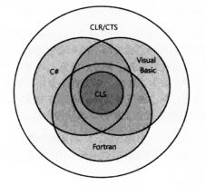

- 将源代码编译成托管模块
- 将托管代码合并成程序集
- 加载公共语言运行时
- 执行程序集的代码
- 本机代码生成器：NGen.exe
- Framework类库
- 通用类型系统
- 公共语言规范(CLS)
- 与非托管代码的互操作性

## 1.1 将源代码编译成托管代码
- 公共语言运行时(Common Language Runtime)，可由多种语言使用的“运行时”。
- CLR 的核心功能(内存管理、程序集加载、安全性、异常处理和线程同步)可由面向 CLR 的所有语言使用。
- 可将编译器视为语法检查器和“正确代码”分析器。
- 编译器的结果都是 托管模块(managed modele)。托管模块是标准的32位 Microsoft Windows 可移植执行体(PE32 Portable Executable)文件，或是标准的64位 Windows 可移植执行体(PE32+)文件，都需要CLR才能运行。
- 托管程序集总是利用 Windows 的数据执行保护(Data Execution Prevention, DEP)和地址空间布局随机化(Address Space Layout Randomization, ASLR)，这两个功能旨在增强整个系统的安全性。
- 托管模块的组成部分：
	- PE32 或 PE32+头
	- CLR头
	- 元数据
	- IL代码
- 元数据的用途(部分)：
	- 元数据避免了编译时对原生 C/C++ 头和库文件的需求，因为在实现类型/成员的 IL 代码文件中，已包含有关引用类型/成员的全部信息。编译器直接从托管模块读取元数据。
	- Microsoft Visual Studio 用元数据帮助写代码。“智能感知”(IntelliSense)技术会解析元数据，告诉你一个类型提供的方法属性事件字段，对于方法还提供参数。
	- CLR 的代码验证过程使用元数据确保代码只执行“类型安全”的操作。
	- 元数据允许将对象的字段序列化到内存块，将其发送给另一台机器，然后反序列化，在远程机器上重建对象状态。
	- 元数据允许垃圾回收器跟踪对象生存期。垃圾回收器能判断任何对象的类型，并从元数据知道那个对象中的哪些字段引用了其它对象。
- C#编辑器总生成包含托管代码和托管数据的模块。
- Microsoft C++编译器允许在托管代码中使用原生 C/C++ 代码。时机成熟后再使用托管类型。

## 1.2 将托管模块合并成程序集
- CLR 实际不和模块工作。它和程序集工作。程序集(assembly)是抽象概念，是一个或多个模块/资源文件的逻辑性分组。程序集是重用、安全性以及版本控制的最小单元。取决于选择的编译器，既可生成单文件程序集，也可生成多文件程序集。在 CLR 中相当于“组件”。
- 利用“程序集”这种概念性的东西，一组文件可作为一个单独的实体来对待。
- 程序集模块是代表逻辑分组的一个PE32(+)文件，包含一个名为清单(manifest)的数据块。清单也是元数据表的集合。这些表描述了构成程序的文件、程序集中的文件所实现的公开导出的类型以及与程序集关联的资源或数据文件。
- 程序集的模块中，还包含与应用的程序集有关的信息(包括它们的版本号)。这些信息使程序及能够自描述(self-describing)。也就是，CLR 能判断为了执行程序集中的代码，程序集的直接依赖对象(immediate dependency)是什么。不需要在注册表或 Active Directory Domain Services(ADDS)中保存额外的信息，所以和非托管组件相比，程序及更容易部署。

## 1.3 加载公共语言运行时
- 要知道是否已安装.NET Framework，检查 %SystemRoot%\System32 目录中是否存在 MSCoreEE.dll。
- 要了解安装了哪些版本的.NET Framework，检查以下目录的子目录：
	- %SystemRoot%\Microsoft.Net\Framework
	- %SystemRoot%\Microsoft.Net\Framework64
- .NET Framework SDK 提供了 CLRVer.exe 命令行，能列出机器上安装的所有CLR版本。(null 或 -all 或 指定目标进程)
- 如果程序及文件只包含类型安全的托管代码，只要机器上安装了对应版本的.NET Framework，文件就能运行。
- 要适用不安全的代码，或者要和面向一种特定 CPU 架构的非托管代码进行互操作，就可能需要C#编译器中 /platform 命令行开关选项。可指定 32位 Windows x86,64位 Windows x64，32位 Windows RT ARM 机器。不指定则为 anycpu。
- Exe运行：
	- Windows检查EXE文件头，决定32位/64位进程后，会在进程地址空间加载 MSCorEE.dll 的 x86,x64或ARM版本。
	- Windows x86或ARM, MSCorEE.dll的x86版本在 %SystemRoot%\System32。
	- Windows x64, MSCorEE.dll的x86版本在 %SystemRoot%\SysWow64, x64版本在 %SystemRoot\System32% (为了向后兼容)。
	- 进程的主线程调用 MSCorEE.dll 中定义的一个方法。这个方法初始化 CLR，加载 EXE 程序集，再调用其入口方法(Main)。随即，托管应用程序启动并运行。

## 1.4 执行程序集的代码
- 托管程序集包含元数据和IL。可将IL视为一种面向对象的机器语言。
- IL也能使用汇编语言编写，Microsoft提供了 ILAsm.exe(IL汇编器)，ILDasm.exe(IL反汇编器)。
- 高级语言通常只公开了CLR全部功能的一个子集。IL汇编语言允许访问CLR的全部功能。
- 允许在不同编程语言之间方便地切换，同时又保持紧密集成，是CLR一个出众的特点。
- 为了执行方法，首先必须把方法的 IL 转换成本机(native)CPU 指令，这是 CLR 的JIT(just-in-time或者"即时")编译器的职责。

- 一个方法首次调用时发生的事情。


- 在 Main 方法执行之前，CLR 会检测出 Main 的代码引用的所有类型。CLR 分配一个内部数据结构来管理对引用类型的访问。如上，Main 引用了一个 Console 类型，CLR分配一个内部结构。在内部结构中，Console 类型定义的每个方法都有一个对应的记录项(entry,条目,入口)。每个记录项都含有一个地址，根据地址可找到方法的实现。对这个结构初始化时，CLR将每个记录项都设置成(指向)包含在CLR内部的一个为编档函数，称为 JITCompiler。
- Main 方法首次调用 WriteLine 时，JITCompiler 函数会被调用。JITCompiler 函数负责将方法的 IL 代码编译成本机 CPU 指令。IL是即时(just in time)编译的。CLR这个组件称为 JITter 或 JIT编译器。
- JITCompiler 函数被调用时，它知道调用的是哪个方法，以及什么类型定义了该方法。然后，JITCompiler 会在定义(该类型的)程序集的元数据中查找被调用方法的 IL。接着，JITCompiler 验证 IL 代码，并将 IL 代码编译成本机CPU指令。本机CPU指令保存到动态分配的内存块中。然后，JITCompiler 回到 CLR 为类型创建的内部数据结构，找到与被调用方法对应的那条记录，修改最初对 JITCompiler 的引用，使其指向内存块(包含了刚才编译好的本机CPU指令)的地址。最后，JITCompiler 函数跳转到内存块中的代码。这些代码即是方法的具体实现。代码执行完毕返回。
- Main 第二次调用 WriteLine。由于已对 WriteLine 的代码进行了验证和编译，所以会直接执行内存块中的代码，完全跳过 JITCompiler 函数。


- 方法仅在首次调用时才会有一些性能损失。以后对于该方法的所有调用都以本机代码的形式全速运行，无需重新验证 IL 并把它编译成本机代码。
- JIT 编译器将本机CPU指令存储到动态内存中。所以重启应用或开多个实例(使用多个不同的操作系统进程)，JIT 必须再次将 IL 编译成本机指令。相比之下，本机(native)应用程序的只读代码页可由应用程序正在运行的所有实例共享。
- CLR 的 JIT编译器会对 本机代码进行优化，这类似于非托管C++编译器的后端所做的事情。同样，可能花较多时间生成优化代码。

- 两个C#编译器开关会影像代码优化： `/optimize` 和 `/debug`。
- 使用 `/optimize-` ，在C#编译器生成的未优化 IL 代码中，将包含许多 NOP(no-operation，空操作)指令，还包含许多跳转到下一行代码的分支指令。Visual Studio 利用这些指令在调试期间提供“编辑并继续”(edit-and-continue)功能。另外，利用这些额外的指令，还可在控制流程指令(比如 for, while, do, if, else, try, catch 和 finally 语句块)上设置断点，使代码更容易调试。相反，如果生成优化的 IL 代码，C#编译器会删除多余的 NOP 和分支指令。而在控制流程被优化之后，代码就很难在调试器中进行单步调试了。另外，若在调试器中执行，一些函数求值可能无法进行。不过，优化的 IL 代码变得更小，结果 EXE/DLL 文件也更小。另外，如果要检查 IL 来理解编译器生成的东西，这种 IL 更易读。
- 此外，只有指定 `/debug(+/full/pdbonly)`开关，编译器才会生成 Program Database(PDB)文件。PDB文件帮助调试器查找局部变量并将 IL 指令映射到源代码。`/debug:full` 开关告诉 JIT 编译器你打算调试程序集，JIT 编译器会记录每条 IL 指令所生成的本机代码。这样就可以利用Visual Studio的“即时”调试功能，将调试器连接到正在运行的进程，并方便地对源代码进行调试。不指定 `/debug:full` 开关，JIT 编译器默认不记录 IL 与本机代码的联系，这使 JIT 编译器运行得稍快，用的内存也稍少。如果进程用Visual Studio调试器启动，会强迫 JIT 编译器记录 IL 与本机代码的联系(无论 /debug 开关的设置是什么)————除非在Visual Studio中关闭了“在模块加载时取消 JIT 优化(仅限托管)”选项。
- 在 Visual Studio 中新建C#项目时，项目的“调试”(Debug)配置指定的是 `/optimize-` 和 `/debug:full` 开关，而“发布”(Release)配置指定的是 `/optimize+` 和 `/debug:pdbonly` 开关。
- 非托管代码针对一种具体的CPU平台编译，调用直接就能执行。
- 托管环境，代码分两阶段编译：首先，编译器遍历源代码，做大量工作生成 IL 代码。想要执行，这些 IL 代码本身必须在运行时编译成本机CPU指令，这需要分配更多的非共享内存，并要花费额外的CPU时间。
- 运行时的二次编译确实会影响性能，也确实会分配动态内存。但 Microsoft 进行了大量性能优化工作，将额外的开销保持在最低限度之内。
- 托管应用程序的性能实际上超越了非托管应用程序。当 JIT 编译器在运行时将 IL 代码编译成本机代码时，编译器对执行环境的认识比非托管编译器更深刻：
	- JIT 编译器能判断应用程序是否运行在 Intel Core i7 CPU 上，并生成相应的本机代码来利用 Core i7 支持的任何特殊指令。相反，非托管应用程序通常是针对具有最小功能集合的 CPU 编译的，不会使用能提升性能的特殊指令。
	- JIT 编译器能判断一个特定的测试在它运行的机器上是否总是失败。例如，`if (numberOfCPUs > 1) { ... }`。如果主机只有一个CPU，JIT编译器不会为上述代码生成任何CPU指令。在这种情况下，本机代码将针对主机进行优化，最终代码变得更小，执行更快。
	- 展望：应用程序运行时，CLR 可以进行评估代码的执行，并将 IL 重新编译成本机代码。重新编译的代码可以重新组织，根据刚才观察到的执行模式，减少不正确的分支预测。
- 为了确认 JIT 编译器使应用程序达到应有的性能。
- 应使用 .NET Framework SDK 配套提供的 NGen.exe 工具。它将程序集的所有 IL 代码编译成本机代码，并将其保存到一个磁盘文件中。在运行时加载程序集时，CLR 自动判断是否存在该程序集的预编译版本。如果是，CLR就加载预编译代码，就避免了在运行时进行编译。注意，NGen.exe 对最终执行环境的预设是很保守的(不得不)。所以，NGen.exe 生成的代码不会像 JIT 编译器生成的代码那样进行高度优化。
- 另外可考虑使用 System.Runtime.ProfileOptimization 类。该类法制 CLR 检查程序运行时哪些方法被 JIT 编译，结果被记录到一个文件。程序再次启动时，如果是在多CPU机器上运行，就用其他线程并发编译这些方法。这使应用程序运行得更快，因为多个方法并发编译，而且是在应用程序初始化时编译，而不是在用户和程序交互时才“即时”编译。

### 1.4.1 IL 和验证
- IL 基于栈。它的所有指令都要将操作数压入(push)一个执行栈，并从栈弹出(pop)结果。由于 IL 没有提供操作寄存器的指令，所以人们可以很容易地创建新的语言和编译器，生成面向 CLR 的代码。
- IL 指令是"无类型"(typeless)的。例如，IL 用 `add` 指令将压入栈的最后两个操作数加到一起。`add`指令不分 32/64位 。`add`执行时，它判断栈中的操作数的类型，给予恰当操作。
- IL 最大的优势不是对底层CPU的抽象，而是应用程序的健壮性和安全性。将 IL 编译成本机CPU指令时，CLR执行一个名为验证(verification)的过程。会检查高级 IL 代码，确定代码所做的一切都是安全的。
- Windows 的每个进程都有自己的虚拟地址空间，因为应用程序完全可能读写无效的内存地址。通过验证托管代码，可确保代码不会不正确的访问内存，就可以将多个托管应用程序放到同一个Windows虚拟地址空间运行。
- 用一个进程运行多个应用程序，减少进程数，增强性能，减少所需资源，健壮性也无下降，这是托管代码相较于非托管代码的另一优势。CLR 提供了在一个操作系统进程中执行多个托管应用程序的能力。每个托管应用程序都在一个 AppDomain 中执行。每个托管 EXE 文件默认都在自己的独立地址空间中运行，这个地址空间只有一个 AppDomain。然而，CLR 的宿主进程(比如 IIS 或 Microsoft SQL Server)可决定在一个进程中运行多个 AppDomain。
- 使用不安全的(unsafe)代码可能破坏数据结构，危害安全性，造成安全漏洞。C#编译器要求包含不安全代码的所有方法都用`unsafe`关键字标记。并使用`/unsafe`编译器开关来编译源代码。
- 当 JIT 编译器编译 `unsafe` 方法时，会检查方法程序集是否被授予 `System.Security.Permissions.SecurityPermission` 权限，而且 `System.Security.Permissions.SecurityPermissionFlag` 的 `SkipVerification` 标志是否设置。如果设置，会编译并允许执行。没设置，JIT 编译器会抛出 `System.InvalidProgramException` 或 `System.Security.VerificationException` 异常，禁止方法执行。
- 从本地计算机或“网络共享”加载的程序集默认被授予完全信任，但通过 Internet 执行的程序集默认不被授予执行不安全代码的权限。
- Microsoft 提供了 PEVerify.exe，他检查一个程序集的所有方法，并报告其中含有不安全代码的方法。(测试:通过内网或Internet)。
- 验证要访问所有以来的程序集中包含的元数据。当使用 PEVerity 检查程序集时，它必须能够定位并加载引用的所有程序集。PEVerity 使用 CLR 定位依赖程序集，采用平时执行程序集时一样的 绑定(binding) 和 探测(probing) 来定位程序集。

## 1.5 本机代码生成器 NGen.exe
- 在应用程序安装到用户的计算机上时，将 IL 代码编译成本机代码。因此，CLR 的 JIT 编译器不需要再运行时编译 IL 代码，有助于提升应用程序的性能。
- 1.提高应用程序的启动速度
- 2.减小应用程序的工作集(working set)(指在进程的所有内存中，已映射的物理内存)。如果一个程序集同时加载到多个进程中，对该程序集运行 NGen.exe 可减小应用程序的工作集。NGen.exe 将 IL 编译成本机代码，并将这些代码保存到单独的文件中。文件通过“内存映射”同时映射到多个进程地址空间中，使代码得到共享，避免每个进程都需要一份单独的代码拷贝。
- 进程：物理内存(CPU可直接访问)，虚拟内存(可能在转换列表中，CPU不能通过虚地址访问，需要Windows映射之后才能访问)，磁盘上的分页文件。
- 安装程序调用 NGen.exe 是，应用程序的所有或指定程序集的 IL 代码会编译成本机代码。NGen.exe 新建一个程序集文件，只包含这种本机代码，不含任何 IL。放在 `%SystemRoot%\Assembly\NativeImages_v4.0.#####_64` 这样的一个目录下的一个文件夹中。目录名包含 CLR版本号，本机代码是由 32\64 Windows编译。
- 当 CLR 加载程序集文件，都会检查是否有 NGen 生成的本机文件，如果找不到就对 IL 进行 JIT 编译。
- NGen好处：
	- 托管代码的好处(垃圾回收、验证、类型安全等)。
	- 没有托管代码(JIT编译)的所有性能问题等。
- NGen生成的文件的问题：
	- 没有知识产权保护。只发布 NGen.exe 来达到保护是不行的。在运行时，CLR 要求访问程序集的元数据(用于反射和序列化等)，所以必须要发布包含 IL 和元数据的程序集。CLR 也可能因为某些原因不能使用 NGen 生成的文件。
	- NGen 生成的文件可能失去同步。CLR 加载 NGen 生成的文件时，会将预编译代码和许多特征与当前执行环境进行比较。例句部分特征：
		- CLR 版本：随补丁或 Service Pack 改变。
		- CPU 类型：升级处理器发生改变、
		- Windows 操作系统版本：安装新 Service Pack 后改变。
		- 程序集的标识模块版本ID(Modele Version ID, MVID)：重新编译后改变。
		- 引用的程序集的版本ID：重新编译引用的程序集后改变。
		- 安全性：吊销了之前的授权后，安全性就会发生改变。权限包括声明性继承(declarative inheritance)、声明性连接时(declarative link-time)、SkipVerification 或者 UnmanagedCode 权限。
		- `注意 可使用更新(update)模式运行 NGen.exe，使 NGen 生成的文件与新安装的 CLR 版本同步，在安装.NET Framework 的新 Service Pack 时，安装程序会自动用更新模式运行 NGen.exe`
	- 较差的执行时性能。编译时，NGen 不能像 JIT 编译器那样对执行环境进行许多假定。例如，NGen 不能优化地使用特定 CPU 指令；静态字段只能间接访问(实际地址只能在运行时确定)。假如考虑使用 NGen.exe 来提升应用程序的性能，需进行比较。
	
- 对于服务器端应用程序，NGen.exe 的作用不明显甚至无作用，因为只有第一个客户端请求才能感受到性能的下降，后续的客户端请求都能以全速运行。
- 对于客户端应用程序，使用 NGen.exe 也许能提高启动速度，或者缩小工作集。
- 对于启动很慢的大型客户端应用程序，Microsoft 提供了 Managed Profile Guided Optimization 工具(MPGO.exe)。该工具分析程序执行，检查它在启动时需要那些东西。这些东西反馈给 NGen.exe 来更好的优化本机映像，使应用程序启动更快工作集缩小。准备发布应用程序时，用 MPGO 工具启动它，走一遍程序的常规任务。与所执行代码有关的信息会写入一个 profile 并嵌入程序集文件中。NGen.exe 工具利用 profile 数据来更好地优化它生成的本机映像。

## 1.6 Framework 类库
- .NET Framework 包含 Framework 类库(Framework Class Library, FCL)。FCL 是一组 DLL 程序集的统称，其中含有数千个类型定义，每个类型都公开了一些功能。Microsoft 还发布了其他库，比如 Windows Azure SDK 和 DirectX SDK。
- 利用这些程序集创建的部分应用：
	- Web 服务(Web service)
	利用 Microsoft 的 ASP.NET XML Web Service 技术或者 Microsoft 的 Windows Communication Foundation(WCF)技术，可以简单地处理通过 Internet 发送的消息。
	- 基于 HTML 的 Web 窗体/MVC 应用程序(网站)
	ASP.NET 应用程序查询数据库并调用 Web 服务，合并和筛选返回的信息，使用基于 HTML 的“富”用户界面，在浏览器中显示。
	- “富” Windows GUI 应用程序
	用 Windows Store、Windows Presentation Foundation(WPF) 或者 Windows Forms 技术提供更强大性能更好的功能。可以直接与底层操作系统交换信息。
	- Windows 控制台应用程序
	对UI要求很简单。编译器、实用程序和工具。
	- Windows 服务
	用 .NET Framework 生成“服务”应用程序，通过“Windows 服务控制管理器”(Service Control Manager, SCM)控制。
	- 数据库存储过程
	Microsoft 的 SQL Server、IBM 的 DB2 以及 Oracle 的数据库服务器允许用 .NET Framework 写存储过程。
	- 组件库
	.NET Framework 允许生成独立程序集(组件)。

## 1.7 通用类型系统
- Microsoft 指定了一个正式的规范类描述类型的定义和行为，“通用类型系统”(Common Type System, CTS)。
- Microsoft 将 CTS 和 .NET Framework 的其他组件(包括文件格式、元数据、中间语言以及对底层平台的访问(P/Invoke))提交给 ECMA 标准化，形成的标准为“公共语言基础结构”(Common Language Infrastructure, CLI)。Microsoft 还提交了 Framework 类库的一部分，C#编程语言(ECMA-334)以及 C++/CLI 编程语言。
- CTS 规范规定，一个类型可以包含零个或者多个成员。
	- 字段(Field)
	- 方法(Mehtod)
	- 属性(Property)
	- 事件(Event)
- CTS 制定了类型可见性规则以及类型成员的访问规则。
	- private
	- family(protected in C#)：派生类
	- family and assembly(C#中没有提供)
	- assembly(internal in C#)：同一程序集
	- family or assembly(protected internal in C#)：任何程序集中的派生类或同一程序集中的任意类。
	- public
- CTS 为类型继承、虚方法、对象生存期等定义了相应的规则。
- CTS 规定单继承
- CTS 规定所有类型最终必须从预定义的 `System.Object` 继承。`System.Object` 允许做：
	- 比较两个实例的相等性。
	- 获取实例的哈希码。
	- 查询一个实例的真正类型。
	- 执行实例的浅(按位)拷贝。
	- 获取实例对象当前状态的字符串表示。

## 1.8 公共语言规范
- 创建从其他编程语言中访问的类型，Microsoft 定义了“公共语言规范”(Common Language Specification, CLS)，详细定义了一个最小功能集。

- 每种语言都提供了 CLR/CTS 的一个子集以及 CLS 的一个超集(但不一定是同一超集)
- 以下代码使用 C# 定义一个符合 CLS 的类型。类型中含有几个不符合 CLS 的构造，造成 C# 编译器报错：

```
using System;

// 告诉编译器检查 CLS 相容性
[assembly: CLSCompliant(true)]

namespace SomeLibrary {
	// 因为是 public 类，所以会显示警告
	public sealed class SomeLibraryType {

		// 警告：SomeLibrary.SomeLibraryType.Abc() 的返回类型不符合 CLS
		public UInt32 Abc() { return 0; }

		// 警告：仅大小写不同的标识符 SomeLibrary.SomeLibraryType.abc() 不符合CLS
		public void abc() { }

		// 不显示警告：该方法是私有的
		private UInt32 ABC() { return 0; }
```

- 将 `[assembly:CLSCompliant(true)]` 特性应用于程序集。编译器检查其中的任何公开类型，判断是否存在任何不合适的构造阻止了从其他编程语言中访问该类型。

## 1.9 与非托管代码的互操作性
- CLR 允许在应用程序中同时包含托管和非托管代码。
	- 托管代码能调用 DLL 中的非托管函数
	托管代码通过 P/Invoke(Platform Invoke)机制调用 DLL 中的函数。
	- 托管代码可以使用现有 COM 组件(服务器)
	- 非托管代码可以使用托管类型(服务器)
- Microsoft 公开了 Type Library Importer 工具和 P/Invoke Interop Assistant 工具的源码，Http://CLRInterop.CodePlex.com


# 2 生成、打包、部署和管理应用程序及类型
- .NET Framework 部署目标
- 将类型生成到模块中
- 元数据概述
- 将模块合并成程序集
- 程序及版本资源信息
- 语言文化
- 简单应用程序部署(私有部署的程序集)
- 简单管理控制(配置)

## 2.1 .NET Framework 部署目标
- Windows 不稳定和过于复杂：
	- 所有应用程序都使用来自 Microsoft 或其他厂商的动态链接库(Dynamic-Link Library, DLL)。(DLL hell)
	- 安装的复杂性。(备份不易、移动不易、卸载不易)
	- 安全性。

## 2.2 将类型生成到模块中
- 源代码文件 Program.cs (C:\Program Files (x86)\MSBuild\14.0\Bin)

```
public sealed class Program {
	public static void Main() {
		System.Console.WriteLine("Hi");
	}
}
```

- cmd 执行 csc.exe /out:Program.exe /t[arget]:exe /r[eference]:MSCorLib.dll program.cs
- 可简化成 csc.exe Program.cs
- csc.exe /out:Program.exe /t:exe /nostdlib Program.cs 报错，没有自动引用 MSCorLib.dll
- C# 编译器生成的 Program.exe 文件是标准 PE(可移植执行体, Portable Executable)，意味着 Windows 32/64 能加载它。
- Windows 支持三种应用程序：
	- 生成 控制台用户界面(Console User Interface, CUI) 应用程序使用 `/t:exe` 开关。
	- 生活 图形用户界面(Graphical User Interface, GUI) 应用程序使用 `/t:winexe` 开关。
	- 生成 Windows Store 应用使用 `/t:appcontainerexe` 开关。
- 响应文件：包含一组编译器命令行开关的文本文件。MyProject.rsp:
	```
	/out:MyProject.exe
	/target:winexe
	```
- CSC.exe 使用响应文件：
`csc.exe @MyProject.rsp CodeFile1.cs CodeFile2.cs`
- C# 编译器支持多个响应文件。CSC.exe 运行时，会在其所在目录查找全局 CSC.rsp 文件。设置发生冲突：命令行显式指定 > 本地响应文件 > 全局响应文件。
- .NET Framework 目录 %SystemRoot%\Microsoft.NET\Framework(64)\vX.X.X 中有全局 CSC.rsp 文件。
- 引用所有这些程序集对编译器的速度有一点影像，但如果源代码中没有引用，就不会影像最终程序集。
- 指定 `/noconfig` 命令行开关，编译器会忽略本地和全局 CSC.rsp 文件。

## 2.3 元数据概述


